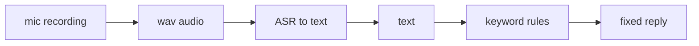

# Lecture 42 · Audio Recording / Speech-to-Text / Rule-Based Voice Dialogue

> **Lecture info**
> - Date: 2026-09-24 (Thu)
> - Lecture #: 42 (Study Plan Day 42, P9 Speech / LLM / Ollama / MCP)
> - Plan ref: `study-plan-60d.md` → **P9**, episodes **161–164**
> - Goal: Give the robot “ears” — **record → ASR into text → answer by rules**. Also deploy the YOLO model you trained into the live camera view. P8 made it “see”; P9 starts making it “hear”.

---

## 0. One-line summary

> **Step one of the speech chain = ASR (Automatic Speech Recognition): turn sound waves into text.** Today we answer with the simplest thing — **rule matching** (a keyword hit returns a fixed reply). It’s simple and controllable, but rephrase the sentence and it breaks; that limitation is exactly the motive for bringing in an LLM on Day 44.

---

## 1. Core concepts (eps 161–164)

### 1.1 161 Audio-recording code
- Record with pyaudio / sounddevice and save as .wav.
- Three key parameters: **sample rate** (commonly 16000 Hz), **channels** (mono is fine), **bit depth** (16-bit).
- Watch out: mic permission off or wrong device index → you record pure silence.

### 1.2 162 Speech-to-text
- **ASR** converts speech to text. Options: cloud APIs (Whisper API, vendor SDKs) or a local model (Whisper deployed locally).
- Input: audio file/stream. Output: a string of text.

### 1.3 163 Rule-based voice dialogue
- How it works: a keyword hit returns a fixed reply — essentially **keyword / template matching**.
- Pros: **deterministic, controllable, zero cost**; good for fixed command sets (“forward / back / grasp”).
- Cons: **rephrasing breaks it** (“switch the light on” may not match), and there is no memory of context.

### 1.4 164 Deploying YOLO on live video
- Hook the Day-41 YOLO model to the live camera stream (Day 37 skill) and show boxes in real time.
- The vision side closes its loop here: **see → locate → (with hand-eye calibration) grasp**; the speech side is just getting started.

---

## 2. Principles (grab these)

1. **ASR = sound → text**, the prerequisite for “understanding”.
2. **Rule dialogue = keyword matching**: controllable but rigid, zero generalization.
3. **Full speech chain**: listen (ASR) → understand (brain/LLM) → speak (TTS) — today covers only a prototype of the first two.

---

## 3. One diagram: the minimal speech chain

---

## 4. Today’s steps

1. **Watch 161–164** (1.0–1.5×), focus on 161 (recording params) and 163 (writing rules).
2. **Get recording working**: record 3 seconds to wav, play it back and confirm it is **not silence**.
3. **Get ASR working**: convert the wav to text and print it to check accuracy.
4. **Write rule dialogue**: 5 commands (e.g. forward/back/left/right/stop); hit → reply, miss → “didn’t catch that”.
5. **Test paraphrases** (“move ahead” vs “forward”) and note where the **rules fail**.
6. **Run YOLO live on the camera**, save a screenshot.
7. **Mirror test (3 min):** *“What ASR does ___; rule-dialogue pros ___ and cons ___; the three steps of the full speech chain ___.”*

> **Done today when:** recording + ASR + rule dialogue run + YOLO live demo + mirror test passed.

---

## 5. Common pitfalls

| # | Myth | Truth |
|---|---|---|
| 1 | Convert to text without checking there is sound | Wrong device index / no permission → silence → empty result |
| 2 | Set the sample rate arbitrarily | Mismatched with the ASR model → accuracy collapses (16 kHz is common) |
| 3 | Expect rule dialogue to chat | Rephrasing breaks it; there is no semantic understanding |
| 4 | Ignore ambient noise | Noisy audio → wrong ASR → the whole chain is wrong |
| 5 | Write dozens of rules up front | Start minimal (5 rules); expand after the chain works |

---

## 6. DEA cross-link (light, not main thread)

- In soft systems, **rule-based control** (fixed voltage levels, fixed timing) is just like today’s rule dialogue: simple and reliable, but helpless in an unseen condition.
- Replacing rules with learned policies later mirrors Day 44 replacing keywords with an LLM — **the “rules → learning” upgrade path is the same road in your soft-actuator control research**.

---

## 7. Next / checkpoint

- **Checkpoint passed =** recording/ASR/rule dialogue run + YOLO live demo + mirror test.
- **Next (Day 43):** voice-chat system / TTS synthesis / full speech-dialogue flow (165–167).

---

### References (not required today)
- Episodes 161–164 (B站《黑马程序员 · 具身智能》).
- Reuse: Day 37/41 (YOLO inference & deployment).

*This lecture strictly follows 《60-Day Plan》 Day 42 (P9): 161–164. Zero military content.*
