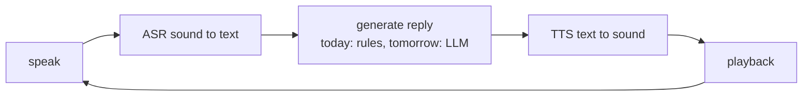

# Lecture 43 · Voice-Chat System / TTS Synthesis / Full Speech-Dialogue Flow

> **Lecture info**
> - Date: 2026-09-25 (Fri)
> - Lecture #: 43 (Study Plan Day 43, P9)
> - Plan ref: `study-plan-60d.md` → **P9**, episodes **165–167**
> - Goal: Give the robot a “mouth” — **TTS (Text To Speech)** — and chain **ASR → reply → TTS** into a complete spoken-dialogue loop. After today, the minimal “can hear, can speak” loop exists.

---

## 0. One-line summary

> **Full speech-dialogue flow = listen (ASR: sound→text) → think (generate reply) → speak (TTS: text→sound).** Today the “think” step is still simple logic/rules; from tomorrow it becomes an LLM — **build the skeleton first, swap the brain later**.

---

## 1. Core concepts (eps 165–167)

### 1.1 165 A simple voice-chat system
- Wire yesterday’s three parts into a loop: **record → ASR → generate reply → TTS playback → wait for the next utterance**.
- Engineering notes:
  - **Wait for a trigger** (wake word or keypress) instead of transcribing continuously — otherwise you burn CPU for nothing.
  - **Clear/reset the audio buffer** after each turn, or the next sentence carries the tail of the previous one.

### 1.2 166 TTS synthesis
- **TTS = Text To Speech**: read text out loud.
- Options: cloud TTS APIs, offline `pyttsx3` (zero dependencies), or neural TTS models (more natural, heavier).
- Tunable: **voice (timbre), rate (speed), volume**.
- Note: offline TTS depends on the voice packs installed on the system — no Chinese voice pack means no sound.

### 1.3 167 Full dialogue-flow demo
- Run the whole thing: say something into the mic → hear it answer.
- Know where **latency comes from**: recording duration + ASR time + generation time + TTS synthesis time. **Big latency kills the experience** — time each segment when optimizing.

---

## 2. Principles (grab these)

1. **Three stages: ASR (listen) → generate (think) → TTS (speak)**; any slow stage drags the whole loop.
2. **TTS turns text into sound**; voice/rate settings define how it feels.
3. **Get the chain running, then upgrade the parts**: simple replies today, an LLM tomorrow.

---

## 3. One diagram: the spoken-dialogue loop

---

## 4. Today’s steps

1. **Watch 165–167** (1.0–1.5×), focus on 166 (TTS params) and 167 (end-to-end latency).
2. **Get TTS working**: synthesize and play one Chinese sentence; change rate/voice and hear the difference.
3. **Chain the loop**: press to talk → release → ASR → reply → TTS playback.
4. **Time each segment** (record / ASR / generate / TTS) and find the slowest one.
5. **Run 5 consecutive dialogue turns**; check whether the previous sentence’s tail leaks into the next.
6. **Mirror test (3 min):** *“The three speech-dialogue stages ___; what TTS does ___; where latency comes from ___.”*

> **Done today when:** TTS makes sound + the full dialogue loop runs + mirror test passed.

---

## 5. Common pitfalls

| # | Myth | Truth |
|---|---|---|
| 1 | No sound means the code is wrong | Usually a missing Chinese voice pack or the wrong audio device |
| 2 | Keep the mic transcribing continuously | Burns CPU and tends to record the echo |
| 3 | Don’t clear the buffer per turn | The previous tail leaks in; transcripts turn into garbage |
| 4 | Optimize only the model, ignore I/O | Real latency often sits in recording/playback, not inference |
| 5 | Record while playing audio | You record your own output (echo); add simple mutual exclusion / noise handling |

---

## 6. DEA cross-link (light, not main thread)

- Map this loop onto a soft system: **ASR ≈ sensor acquisition, generation ≈ control policy, TTS ≈ actuator output**. If any stage lags, the whole loop destabilizes — and soft actuators are inherently slow to respond (large charge/discharge time constants), so the **latency budget is tighter**. Budget this in when choosing your control frequency.

---

## 7. Next / checkpoint

- **Checkpoint passed =** TTS produces sound + dialogue loop runs + mirror test.
- **Next (Day 44):** integrate an LLM into voice dev / limits of the current flow / file-access exceptions (168–170).

---

### References (not required today)
- Episodes 165–167 (B站《黑马程序员 · 具身智能》).
- Reuse: Day 42 (ASR and rule dialogue).

*This lecture strictly follows 《60-Day Plan》 Day 43 (P9): 165–167. Zero military content.*
