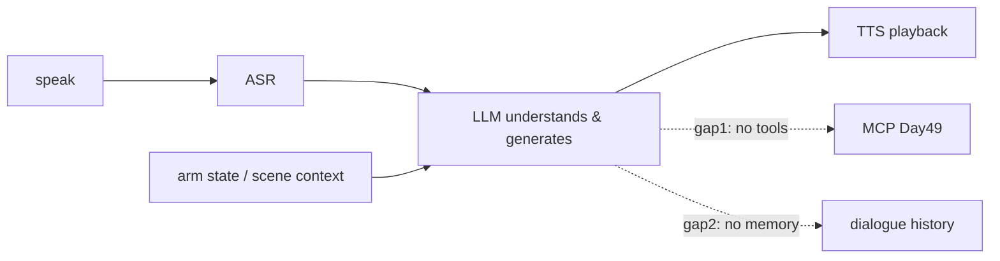

# Lecture 44 · Integrating an LLM / Limits of the Current Flow / File-Access Exceptions

> **Lecture info**
> - Date: 2026-09-26 (Sat)
> - Lecture #: 44 (Study Plan Day 44, P9)
> - Plan ref: `study-plan-60d.md` → **P9**, episodes **168–170**
> - Goal: Replace the “think” step of the speech chain — from keyword rules to an **LLM** — the most rudimentary form of a **VLA / embodied foundation model**. Then face two gaps in the current flow: **no tools, no memory**, and add the most practical engineering safety net: exception handling.

---

## 0. One-line summary

> **Feed the ASR text to an LLM so it understands intent and generates a reply — the robot goes from a keyword answering machine to something that understands human speech.** But right now it **can only talk, not act** (no tool calling — see MCP on Day 49) and it **remembers nothing** (no memory); on the engineering side, wrap file/network I/O in try/except.

---

## 1. Core concepts (eps 168–170)

### 1.1 168 Voice development with an LLM
- Chain upgraded to: **record → ASR → LLM generates reply → TTS**.
- How to connect: call the LLM API (cloud or local), send the user text as a `user` message, take back the reply text.
- **The prompt defines persona and boundaries**: one line like “You are a desktop robot-arm assistant; answer concisely” changes the output style immediately.

### 1.2 169 Limits of the current chat flow
1. **No tools**: the LLM can only “talk”, it cannot turn on a lamp or grasp anything — **it is disconnected from the physical world**. MCP on Day 49 fills this gap.
2. **No memory**: each turn is independent; it doesn’t know what was said last (unless you send the history along).
3. **No live state**: it has no idea of the arm’s joint angles or what the camera sees — **you must inject context (state / scene description) into the prompt**, otherwise it is “chatting blind”.

### 1.3 170 Handling file-access exceptions
- File and network I/O is where things crash most: **missing path, insufficient permission, wrong encoding, file locked**.
- Standard practice: `try / except` for specific exceptions + a readable message + fall back to defaults when needed; never swallow errors with `except: pass`.

---

## 2. Principles (grab these)

1. **The LLM replaces *understanding and generation*, not ASR/TTS.**
2. **LLMs don’t know the live world** — you must feed state through the prompt (context).
3. **Chatting ≠ doing**: real hardware control needs a tool-calling protocol (MCP).

---

## 3. One diagram: the chain after adding an LLM, and its gaps

---

## 4. Today’s steps

1. **Watch 168–170** (1.0–1.5×), focus on 169 (the listed gaps) and 170 (exception patterns).
2. **Connect an LLM** (cloud API or local Ollama — installed on Day 46) so the voice chain uses it for replies.
3. **Write a system prompt** defining identity and tone; compare outputs with and without it.
4. **Inject arm state into the prompt** (e.g. “current joint angles: [0, 30, -10]”) and see whether it answers accordingly.
5. **Verify both gaps**: ask “what did I say last sentence?” (no memory) and “lift the arm” (no tools).
6. **Wrap file I/O in try/except**; deliberately use a nonexistent path and confirm the program survives with a clear message.
7. **Mirror test (3 min):** *“Which stage does the LLM replace ___; the two gaps in the current flow ___; why inject state into the prompt ___.”*

> **Done today when:** the LLM is wired into the voice chain + both gaps explained + exception handling in place + mirror test passed.

---

## 5. Common pitfalls

| # | Myth | Truth |
|---|---|---|
| 1 | The LLM knows the arm’s current state | It only sees the text you send; you must feed context actively |
| 2 | If it can chat, it can control hardware | A tool-calling layer (MCP) and an execution interface are still missing |
| 3 | Swallow exceptions with `except: pass` | Errors get hidden and debugging becomes guesswork |
| 4 | Pick a huge model | Local VRAM runs out (OOM); start with 0.5B/1.5B |
| 5 | No boundaries in the prompt | It rambles, goes off-topic, or fabricates |

---

## 6. DEA cross-link (light, not main thread)

- “**Can chat ≠ can act**” is even sharper for soft robots: an LLM can describe “gently bulge the membrane”, but **it doesn’t understand hysteresis or breakdown-voltage limits** — these **physical constraints must be written into the prompt or enforced by a post-hoc safety check**; never let the model emit raw high-voltage commands.
- That’s a genuine research opening for you: **safety guardrails for LLM-driven soft actuators**.

---

## 7. Next / checkpoint

- **Checkpoint passed =** LLM wired into the voice chain + both gaps explained + mirror test.
- **Next (Day 45):** LLM concepts / underlying principles / DeepSeek and pruning-distillation (171–174).

---

### References (not required today)
- Episodes 168–170 (B站《黑马程序员 · 具身智能》).
- Reuse: Day 42–43 (ASR/TTS chain).

*This lecture strictly follows 《60-Day Plan》 Day 44 (P9): 168–170. Zero military content.*
