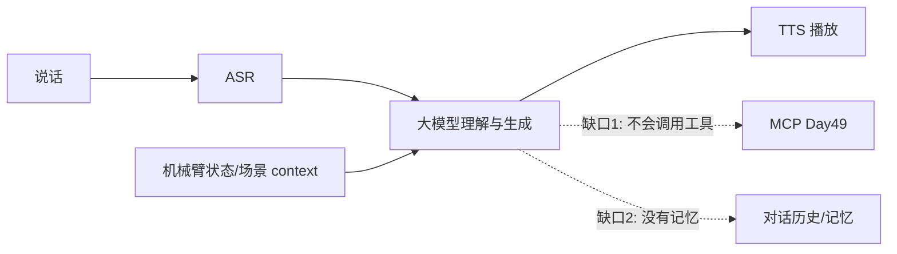

# 第四十四讲 · 对接大模型 / 当前流程的缺陷 / 文件访问异常

> **本讲信息**
> - 日期：2026-09-26（周六）
> - 第几讲：第四十四讲（学习计划 Day 44，P9）
> - 对应计划：`study-plan-60d.md` → **P9**，课程集号 **168–170**
> - 今日目标：把语音链路里的“想”这一步，从关键词规则换成**大模型**——这就是 **VLA / 具身大模型**最朴素的雏形。同时看清当前流程的两个短板：**没有工具、没有记忆**，并补上最实用的工程兜底：异常处理。

---

## 0. 一句话总结

> **把 ASR 出来的文字丢给大模型，让它理解意图并生成回复——机器人就从“关键词应答机”变成了“能听懂人话的对话者”。** 但此刻它**只会说不会做**（没有工具调用能力，见 Day 49 的 MCP），也**记不住上下文**（没有记忆）；工程上则要用 try/except 兜住文件/网络异常。

---

## 1. 核心知识点（对照 168–170）

### 1.1 168 对接大模型的语音开发
- 链路升级为：**录音 → ASR → 大模型生成回复 → TTS**。
- 接入方式：调用大模型 API（云端或本地），把用户文本作为 `user` 消息发过去，拿到回复文本。
- **提示词（prompt）决定人格与边界**：给它一句“你是桌面机械臂助手，回答简洁”，输出风格立刻不同。

### 1.2 169 当前聊天流程的缺陷
1. **没有工具**：大模型只能“说”，不能真的去开灯、去抓东西——**它和物理世界是断开的**。这个缺口由 Day 49 的 MCP 补上。
2. **没有记忆**：每轮对话都是独立的，它不知道上一句说了什么（除非你把历史一起发过去）。
3. **不知道实时状态**：它不了解机械臂当前角度、相机里有什么——**必须把 context（状态/图像描述）塞进 prompt**，否则它是在“盲聊”。

### 1.3 170 访问文件异常的解决方案
- 文件和网络 I/O 是最容易崩的地方：**路径不存在、权限不足、编码不对、文件被占用**。
- 标准做法：`try / except` 捕获具体异常 + 打印可读提示 + 必要时回退默认值；不要用 `except: pass` 把错误吞掉。

---

## 2. 原理（先抓这几条）

1. **大模型替换的是“理解与生成”这一环**，不是替换 ASR/TTS。
2. **大模型不懂实时世界**，必须通过 prompt 把状态喂给它（context）。
3. **会聊天 ≠ 会做事**：要真正控制硬件，还需要工具调用协议（MCP）。

---

## 3. 一张图：加了大模型之后的链路与缺口

---

## 4. 今天的操作步骤

1. **看 168–170**（1.0–1.5 倍速），重点看 169 列出的缺陷、170 异常处理写法。
2. **接上一个大模型**（云端 API 或本地 Ollama，Day 46 会装），让语音链路走它生成回复。
3. **写一句 system prompt**，定义它的身份与回答风格，对比有无 prompt 的输出差异。
4. **把机械臂状态塞进 prompt**（如“当前关节角：[0, 30, -10]”），看它能否据此回答。
5. **验证两个缺陷**：问它“上一句我说了什么”（无记忆）、让它“把机械臂抬起来”（无工具）。
6. **给文件读写加 try/except**，故意制造一个不存在路径，确认程序不崩且提示清晰。
7. **镜子测试（3 分钟）：** *“大模型替换了哪一环___；当前流程两个缺陷___；为什么要把状态塞进 prompt___。”*

> **今天“做完”的标准：** 大模型接进语音链路 + 讲清两个缺陷 + 异常处理兜底 + 过镜子测试。

---

## 5. 常见误区 & 容易踩的坑

| # | 误区 | 真相 |
|---|---|---|
| 1 | 以为大模型知道机械臂现在啥状态 | 它只看到你发给它的文字，必须主动喂 context |
| 2 | 以为会聊天就会控硬件 | 还缺工具调用层（MCP）与执行接口 |
| 3 | 用 `except: pass` 吞异常 | 错误被隐藏，排查时一头雾水 |
| 4 | 模型选太大 | 本地显存不够直接 OOM，从 0.5B/1.5B 小模型起步 |
| 5 | prompt 不设边界 | 它会自由发挥，答非所问甚至编造 |

---

## 6. DEA 交叉链接（轻量，非主线）

- “**会聊天 ≠ 会做事**”这一点在软体上更明显：大模型可以描述“把薄膜轻轻鼓起”，但**它不懂迟滞、不懂击穿电压边界**——要把这些**物理约束写进 prompt 或做后置安全校验**，不能让模型直接输出电压指令。
- 这是你可以做的一个真实研究口子：**面向软体执行器的大模型安全护栏（safety guardrail）**。

---

## 7. 下一阶段 / 检查点

- **过了检查点 =** 大模型接进语音链路 + 讲清两个缺陷 + 过镜子测试。
- **下一阶段（Day 45）：** 大模型概念 / 底层原理 / DeepSeek 与裁剪蒸馏（171–174）。

---

### 参考资料（先放着，今天不要求）
- 课程集号 168–170（B 站《黑马程序员 · 具身智能》）。
- 复用：Day 42–43（ASR/TTS 链路）。

*本讲严格对应《60 天计划》Day 44（P9）：168–170。全程零军事内容。*
