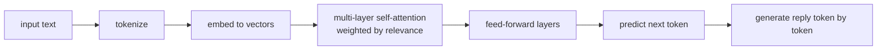

# Lecture 45 · LLM Concepts / Underlying Principles / DeepSeek & Pruning-Distillation

> **Lecture info**
> - Date: 2026-09-27 (Sun)
> - Lecture #: 45 (Study Plan Day 45, P9)
> - Plan ref: `study-plan-60d.md` → **P9**, episodes **171–174**
> - Goal: Go one layer deeper than “how to use it” — understand **how an LLM actually works** (Transformer / attention), and why **pruning and distillation** let a small model run on edge devices like a robot arm.

---

## 0. One-line summary

> **The core of an LLM = Transformer + attention: every word can “look back” at the words most relevant to it, which is how context is understood.** When a model is too big to run, **pruning (cut unimportant weights)** and **distillation (a schoolchild imitating a professor’s reasoning)** shrink it — the key to edge deployment.

---

## 1. Core concepts (eps 171–174)

### 1.1 171 LLM-related concepts
- **Parameter count**: the number of learnable numbers in the model (7B = 7 billion). More parameters = more capacity, more VRAM.
- **Token**: the basic unit the model processes (not exactly a “character”; Chinese is roughly 1–2 tokens per character).
- **Context length**: how many tokens fit in one pass; beyond that, input gets truncated.
- **Inference vs training**: training changes parameters (expensive); inference computes results with them (cheaper per call, but high volume).

### 1.2 172 How LLMs work under the hood
- **Transformer** is the dominant architecture; its core is **Self-Attention**.
- **Attention in plain words**: when reading a sentence, each word assigns a “relevance score” to every other word, then aggregates information weighted by those scores — that’s how “it” knows it refers to “the robot arm” mentioned earlier.
- Minimal working picture: **tokenize → embed to vectors → many layers of attention + feed-forward → predict the next token**.
- So an LLM is fundamentally **an extremely strong “next-token predictor”**.

### 1.3 173 DeepSeek introduction
- DeepSeek is a representative open-weight Chinese LLM family; **weights are open and locally deployable**, friendly for scenarios like embodied AI where “data must not leave the machine”.
- Different sizes (1.5B / 7B / larger) correspond to different hardware requirements.

### 1.4 174 Pruning and distillation
- **Pruning**: cut “unimportant connections/neurons” → **smaller, faster** model with slight accuracy loss.
- **Distillation**: train a **student** model to imitate the **teacher** model’s outputs → the small model acquires much of the large one’s ability.
- ⚠️ **Distillation ≠ training from scratch**: the student is copying the teacher’s answer distribution, not rediscovering knowledge.

---

## 2. Principles (grab these)

1. **Attention = weighted aggregation by relevance** — the source of contextual understanding.
2. **An LLM is essentially a next-token predictor.**
3. **Pruning cuts structure, distillation transfers ability** — both aim to make the model run on the edge (on the arm).

---

## 3. One diagram: what an LLM is doing

---

## 4. Today’s steps

1. **Watch 171–174** (1.0–1.5×), focus on 172 (attention) and 174 (pruning vs distillation).
2. **Explain attention in your own words** using a coreference example (“lift the arm, then stop it” — what does “it” refer to?).
3. **Check your machine’s VRAM/RAM** and estimate the model size you can run (rough rule: a 7B model at full precision needs ~28 GB VRAM; quantization cuts this a lot).
4. **Contrast three concepts** — parameters / context length / tokens — one sentence each.
5. **State the difference between pruning and distillation**, with one use case each.
6. **Mirror test (3 min):** *“What attention does ___; what an LLM essentially predicts ___; pruning vs distillation ___.”*

> **Done today when:** you can explain attention in plain words + state the pruning/distillation difference + mirror test passed.

---

## 5. Common pitfalls

| # | Myth | Truth |
|---|---|---|
| 1 | The LLM truly “understands” the world | It predicts the next token statistically; it doesn’t grasp physical consequences |
| 2 | Distillation = retraining from zero | Distillation is a student imitating the teacher’s outputs, not learning from scratch |
| 3 | Bigger parameters are always better | Edge deployment is bounded by VRAM/power; small and fast is often more practical |
| 4 | Context is unlimited | Long input gets truncated; you must compress memory yourself for long chats |
| 5 | Count tokens as characters | Chinese is often 1–2 tokens per character; don’t estimate by character count |

---

## 6. DEA cross-link (light, not main thread)

- **Distillation matters a lot for you**: a high-fidelity physics model of a soft actuator (FEM) is **too slow for real-time control** — that’s the “professor”. Train a lightweight network on simulation data to imitate it (**reduced-order model / surrogate model**) and the idea is the same as distillation.
- That’s a very concrete soft-robotics + AI route: **use the slow-but-accurate model as teacher, distill a fast-enough controller**.

---

## 7. Next / checkpoint

- **Checkpoint passed =** explain attention in plain words + pruning/distillation clear + mirror test.
- **Next (Day 46):** Ollama installation / loading models / common commands (175–177).

---

### References (not required today)
- Episodes 171–174 (B站《黑马程序员 · 具身智能》).
- Reuse: Day 44 (LLM wired into the chain).

*This lecture strictly follows 《60-Day Plan》 Day 45 (P9): 171–174. Zero military content.*
