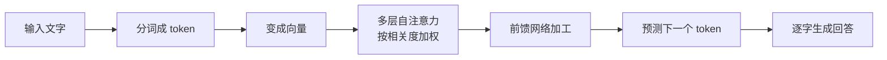

# 第四十五讲 · 大模型概念 / 底层原理 / DeepSeek 与裁剪蒸馏

> **本讲信息**
> - 日期：2026-09-27（周日）
> - 第几讲：第四十五讲（学习计划 Day 45，P9）
> - 对应计划：`study-plan-60d.md` → **P9**，课程集号 **171–174**
> - 今日目标：从“会用”往里走一层，弄明白**大模型到底是怎么工作的**——Transformer / 注意力机制是什么；以及**裁剪（pruning）和蒸馏（distillation）**为什么能让小模型跑在机械臂这种边端设备上。

---

## 0. 一句话总结

> **大模型的核心 = Transformer + 注意力机制：让每个词都能“回头看”整句话里跟它最相关的词，从而理解上下文。** 模型太大跑不动时，用**裁剪（砍掉不重要的权重）**和**蒸馏（让小学生模仿大学教授的答题思路）**把它压小——这是边端部署的关键。

---

## 1. 核心知识点（对照 171–174）

### 1.1 171 大模型相关的概念
- **参数量**：模型里可学习的数字个数（7B = 70 亿个参数）。参数越多，容量越大，也越吃显存。
- **Token**：模型处理文本的基本单位（不一定等于“字”，中文大约 1 字≈1–2 token）。
- **上下文长度（context length）**：一次能塞进去多少 token，超了就会被截断。
- **推理 vs 训练**：训练是改参数（贵），推理是用参数算结果（便宜但量大）。

### 1.2 172 大模型工作的底层原理
- **Transformer** 是主流架构，核心是 **Self-Attention（自注意力）**。
- **注意力大白话**：读一句话时，每个词都会给其他词打一个“相关度分数”，然后按分数把信息加权汇总——所以“它”能知道指的是前文的“机械臂”。
- 工作机制极简版：**输入分词 → 变成向量 → 多层注意力+前馈网络反复加工 → 预测下一个 token**。
- 所以大模型本质是**一个超强的“下一个字预测机”**。

### 1.3 173 DeepSeek 大模型介绍
- DeepSeek 系列是国内代表性开源大模型，**权重开放、可本地部署**，对具身智能这类要“数据不出本地”的场景友好。
- 不同规模（如 1.5B / 7B / 更大）对应不同硬件门槛。

### 1.4 174 裁剪与蒸馏
- **裁剪 Pruning**：把网络里“不重要的连接/神经元”砍掉 → **模型变小、变快**，精度略降。
- **蒸馏 Distillation**：训练一个**小学生模型（student）**去模仿**大学教授模型（teacher）**的输出 → 小模型获得大模型的大部分能力。
- ⚠️ **蒸馏 ≠ 从零训练**：学生是在“抄老师的答案分布”，不是自己重新发现知识。

---

## 2. 原理（先抓这几条）

1. **注意力 = 按相关度加权汇总信息**，这就是大模型“懂上下文”的来源。
2. **大模型本质是下一个 token 的预测器**。
3. **裁剪砍结构、蒸馏传能力**，都是为了让模型能在边端（机械臂上）跑起来。

---

## 3. 一张图：大模型在做什么

---

## 4. 今天的操作步骤

1. **看 171–174**（1.0–1.5 倍速），重点看 172 注意力机制、174 裁剪 vs 蒸馏的区别。
2. **用自己的话解释注意力**：举一个“它/这个”指代消解的例子（如“把机械臂抬起来，然后让它停住”——“它”指谁）。
3. **查一下你机器的显存/内存**，估算能跑多大参数量的模型（粗略经验：7B 模型全精度约需 28 GB 显存，量化后可大幅降低）。
4. **对比三个概念**：参数量 / 上下文长度 / token，各写一句话。
5. **说清裁剪与蒸馏的区别**，各举一个适用场景。
6. **镜子测试（3 分钟）：** *“注意力机制在干什么___；大模型本质在预测什么___；裁剪和蒸馏分别___。”*

> **今天“做完”的标准：** 能白话解释注意力 + 讲清裁剪/蒸馏区别 + 过镜子测试。

---

## 5. 常见误区 & 容易踩的坑

| # | 误区 | 真相 |
|---|---|---|
| 1 | 以为大模型真的“理解”世界 | 它在做统计意义上的下一个 token 预测，不理解物理后果 |
| 2 | 蒸馏 = 重新训练一遍 | 蒸馏是学生模仿教师输出，不是从零学 |
| 3 | 参数越大越好 | 边端部署受显存/功耗限制，小而快往往更实用 |
| 4 | 上下文无限 | 超长会被截断，长对话要自己做记忆压缩 |
| 5 | 把 token 当字数算费用/长度 | 中文 1 字常是 1–2 token，别按字数估 |

---

## 6. DEA 交叉链接（轻量，非主线）

- **蒸馏对你特别有意义**：软体执行器的**高精度物理模型（有限元）算得慢、上不了实时控制**——这不就是“大学教授”吗？用仿真数据训练一个轻量神经网络去模仿它（**模型降阶 ROM /  surrogate model**），思路与蒸馏如出一辙。
- 这是软体 + AI 一条很实在的路线：**用慢而准的模型当老师，蒸馏出快而够用的控制器**。

---

## 7. 下一阶段 / 检查点

- **过了检查点 =** 白话解释注意力 + 讲清裁剪/蒸馏 + 过镜子测试。
- **下一阶段（Day 46）：** Ollama 安装 / 模型加载 / 常用命令（175–177）。

---

### 参考资料（先放着，今天不要求）
- 课程集号 171–174（B 站《黑马程序员 · 具身智能》）。
- 复用：Day 44（大模型接入链路）。

*本讲严格对应《60 天计划》Day 45（P9）：171–174。全程零军事内容。*
