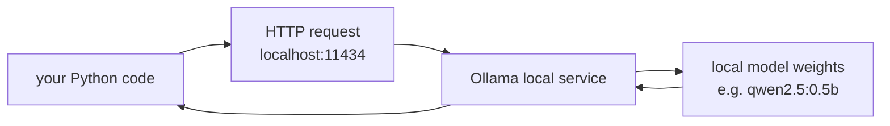

# Lecture 46 · Ollama Installation / Loading Models / Common Commands

> **Lecture info**
> - Date: 2026-09-28 (Mon)
> - Lecture #: 46 (Study Plan Day 46, P9)
> - Plan ref: `study-plan-60d.md` → **P9**, episodes **175–177**
> - Goal: Actually **run an LLM on your own machine** — install **Ollama**, pull a lightweight model, chat from the command line. After this, your robot has a **fully offline brain whose data never leaves the machine**.

---

## 0. One-line summary

> **Ollama = a “one-click launcher” for running LLMs on your own computer**: `ollama pull` downloads a model, `ollama run` starts chatting, `ollama list` shows what’s installed. It wraps the messy parts (environment, quantization, inference backend) and is the standard tool for local embodied-AI deployment.

---

## 1. Core concepts (eps 175–177)

### 1.1 175 Installing Ollama
- Download the installer from the Ollama website (Windows / macOS / Linux) and install.
- Verify: run `ollama --version` in a terminal — a version string means success.
- It starts a **local service** (default port 11434); later your code talks to it over HTTP.

### 1.2 176 Loading models
- Pull: `ollama pull qwen2.5:0.5b` (or `deepseek-r1:1.5b`, etc.).
- **Model tag meaning**: the part after the colon is the size/version (0.5b = 500M parameters) — **smaller = faster and lighter on VRAM, but weaker**.
- Short on hardware? Start with 0.5B / 1.5B and get the chain working first.

### 1.3 177 Common commands
- `ollama list`: show installed models.
- `ollama run <model>`: start a chat.
- `ollama pull <model>`: download/update a model.
- `ollama rm <model>`: delete a model to reclaim space.
- `ollama ps`: show running models and their resource use.
- `/bye` exits a chat; slash commands like `/set parameter num_ctx 4096` tune context length and other params.

---

## 2. Principles (grab these)

1. **Ollama is a local inference service** — model and data stay on your machine and **work offline**.
2. **Parameter size sets the hardware bar**: not enough VRAM → pick a smaller tag or a quantized build.
3. **It exposes an HTTP interface**, so code can call the local model like an API (Day 47).

---

## 3. One diagram: where Ollama sits

---

## 4. Today’s steps

1. **Watch 175–177** (1.0–1.5×), focus on 176 (choosing model size).
2. **Install Ollama** and verify with `ollama --version`.
3. **Pull a small model** (start with `qwen2.5:0.5b`); note download time and size.
4. **Chat from the CLI**: ask two robot-arm questions and judge the answer quality.
5. **Practice the commands**: `list` / `ps` / `rm` (you can skip actually deleting).
6. **Try the context setting**: shrink `num_ctx` and see long input get truncated.
7. **Mirror test (3 min):** *“What Ollama is for ___; pull/run/list ___; what 0.5b in a tag means ___.”*

> **Done today when:** Ollama installed + local model chats + common commands work + mirror test passed.

---

## 5. Common pitfalls

| # | Myth | Truth |
|---|---|---|
| 1 | Start by pulling 7B/14B | Insufficient VRAM → OOM or crawling speed; verify the chain with 0.5B/1.5B first |
| 2 | Assume you must be online | Once downloaded, models run fully offline |
| 3 | Forget it occupies port 11434 | Port taken / firewall blocked → code can’t connect (you’ll hit this on Day 47) |
| 4 | Never set context length | The default may be small; long conversations get truncated |
| 5 | Never clean up models | Each is several GB; disk fills up fast |

---

## 6. DEA cross-link (light, not main thread)

- **Offline local running** is genuinely useful for soft-robotics lab work: during actuation tests, experimental data (voltage–displacement curves, membrane failure logs) often shouldn’t be uploaded to the cloud; a local small model can handle **lab-note organization and parameter suggestions**.
- Further: feed the **physical-constraint documentation** of your soft actuator to a local model as a knowledge base, and it can give sounder operating advice offline — a nice little tool you could build.

---

## 7. Next / checkpoint

- **Checkpoint passed =** Ollama installed + local model chats + mirror test.
- **Next (Day 47):** hyperparameter tuning / Chatbox / calling Ollama from code (178–180).

---

### References (not required today)
- Episodes 175–177 (B站《黑马程序员 · 具身智能》).
- Reuse: Day 44 (LLM in the chain), Day 45 (parameters and VRAM).

*This lecture strictly follows 《60-Day Plan》 Day 46 (P9): 175–177. Zero military content.*
