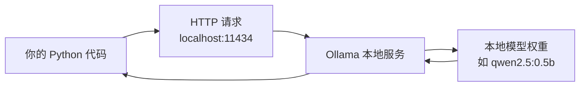

# 第四十六讲 · Ollama 安装 / 模型加载 / 常用命令

> **本讲信息**
> - 日期：2026-09-28（周一）
> - 第几讲：第四十六讲（学习计划 Day 46，P9）
> - 对应计划：`study-plan-60d.md` → **P9**，课程集号 **175–177**
> - 今日目标：在自己的电脑上把大模型**真正跑起来**——装 **Ollama**、拉一个轻量模型、用命令行聊起来。这一步之后，你的机器人就有了一个**完全离线、数据不出本机**的“大脑”。

---

## 0. 一句话总结

> **Ollama = 在你自己电脑上跑大模型的“一键启动器”**：`ollama pull` 下载模型、`ollama run` 开聊、`ollama list` 看已装。它把复杂的环境/量化/推理后端都封装好了，是具身智能本地部署的标配工具。

---

## 1. 核心知识点（对照 175–177）

### 1.1 175 Ollama 框架的安装
- 去 Ollama 官网下载安装包（Windows / macOS / Linux 都有），一路安装。
- 装完验证：终端输入 `ollama --version` 有版本输出即成功。
- 它会在本机起一个**本地服务**（默认端口 11434），后续代码通过 HTTP 调它。

### 1.2 176 Ollama 的模型加载
- 拉模型：`ollama pull qwen2.5:0.5b`（或 `deepseek-r1:1.5b` 等）。
- **模型 tag 的含义**：冒号后是参数规模/版本（0.5b = 5 亿参数），**越小越快越省显存，但能力越弱**。
- 硬件不够就从小模型起步（0.5B / 1.5B），能跑通再说。

### 1.3 177 Ollama 常见命令
- `ollama list`：查看已安装模型。
- `ollama run <model>`：启动对话。
- `ollama pull <model>`：下载/更新模型。
- `ollama rm <model>`：删除模型省空间。
- `ollama ps`：查看正在运行的模型与占用。
- `/bye` 退出对话；`/set parameter num_ctx 4096` 之类的斜杠命令可调上下文长度等参数。

---

## 2. 原理（先抓这几条）

1. **Ollama 是本地推理服务**，模型与数据都在你机器上，**断网也能用**。
2. **参数规模决定硬件门槛**：显存不够就选更小的 tag 或用量化版。
3. **它对外提供 HTTP 接口**，所以代码能像调 API 一样调本地模型（Day 47 会做）。

---

## 3. 一张图：Ollama 在链路里的位置

---

## 4. 今天的操作步骤

1. **看 175–177**（1.0–1.5 倍速），重点看 176 怎么选模型规模。
2. **装 Ollama**，用 `ollama --version` 验证。
3. **拉一个小模型**（建议 `qwen2.5:0.5b` 起步），记录下载耗时与体积。
4. **命令行跑通对话**：问它两个机械臂相关问题，看回答质量。
5. **练一遍命令**：`list` / `ps` / `rm`（rm 可先不用真删）。
6. **试一次上下文设置**：把 `num_ctx` 调小，观察长输入是否被截断。
7. **镜子测试（3 分钟）：** *“Ollama 是干啥___；pull/run/list 分别___；模型 tag 里的 0.5b 意思是___。”*

> **今天“做完”的标准：** Ollama 装好 + 本地模型能对话 + 常用命令会用 + 过镜子测试。

---

## 5. 常见误区 & 容易踩的坑

| # | 误区 | 真相 |
|---|---|---|
| 1 | 一上来拉 7B/14B 大模型 | 显存不够直接 OOM 或极慢；先跑 0.5B/1.5B 验证链路 |
| 2 | 以为必须联网才能用 | 模型下载后可完全离线运行 |
| 3 | 忘了它占用 11434 端口 | 端口被占/防火墙挡 → 代码连不上（后面 Day 47 会踩） |
| 4 | 不设上下文长度 | 默认可能偏小，长对话被截断 |
| 5 | 装完模型不清理 | 模型动辄几个 GB，磁盘很快就满 |

---

## 6. DEA 交叉链接（轻量，非主线）

- **本地离线运行**对软体实验很实用：实验室做驱动测试时，实验数据（电压-位移曲线、薄膜失效记录）往往不便上传云端，本地小模型可以承担**实验记录整理、参数建议**这类辅助工作。
- 进一步想象：把**软体执行器的物理约束文档**作为本地知识库喂给小模型，它就能在离线环境下给出更靠谱的操作建议——这也是你可以做的小工具方向。

---

## 7. 下一阶段 / 检查点

- **过了检查点 =** Ollama 装好 + 本地模型能对话 + 过镜子测试。
- **下一阶段（Day 47）：** 超参数调整 / Chatbox 安装 / 代码与 Ollama 交互（178–180）。

---

### 参考资料（先放着，今天不要求）
- 课程集号 175–177（B 站《黑马程序员 · 具身智能》）。
- 复用：Day 44（大模型接入链路）、Day 45（参数量与显存）。

*本讲严格对应《60 天计划》Day 46（P9）：175–177。全程零军事内容。*
