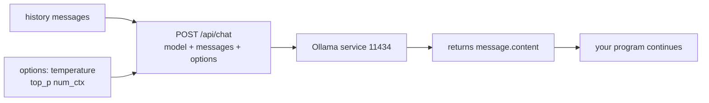

# Lecture 47 · Hyperparameter Tuning / Chatbox / Calling Ollama from Code

> **Lecture info**
> - Date: 2026-09-29 (Tue)
> - Lecture #: 47 (Study Plan Day 47, P9)
> - Plan ref: `study-plan-60d.md` → **P9**, episodes **178–180**
> - Goal: Level up from “chatting in the terminal” to **“calling the model from code”** — that’s how an LLM gets embedded in your robot program. Also learn how to tune the two most-used **hyperparameters** (temperature / top_p).

---

## 0. One-line summary

> **temperature controls “how boldly it improvises”, top_p controls “how wide the candidate pool is”: robot command parsing needs low temperature (deterministic, reproducible); casual chat can go high.** Calling Ollama from code is essentially sending an HTTP request to `http://localhost:11434` with the model name and messages.

---

## 1. Core concepts (eps 178–180)

### 1.1 178 Hyperparameter tuning
- **temperature**: controls randomness.
  - Low (e.g. 0.1) → deterministic and rigid, **the same question gives the same answer**.
  - High (e.g. 1.0+) →发散 and “creative”, but **drifts off-topic and fabricates**.
- **top_p (nucleus sampling)**: only sample from candidates whose cumulative probability reaches top_p (0.9 = consider the top 90% of probability mass).
- **Rules of thumb**:
  - Command parsing / structured output → **temperature 0–0.3** (stability matters).
  - Chit-chat / creative generation → 0.7–1.0.
- Others: `num_ctx` (context length, from Day 46), `num_predict` (max generation length).

### 1.2 179 Installing and using Chatbox
- **Chatbox** is a GUI client that connects to Ollama and various APIs — much nicer than the terminal.
- Setup: pick the interface type (Ollama), fill in the **address and port** (default `http://localhost:11434`), select the model.

### 1.3 180 Calling Ollama from code
- Ollama exposes an HTTP API; the chat endpoint is `POST /api/chat`.
- Key request fields: `model` (model name) and `messages` (history, each with role and content).
- Use Python `requests` or the official `ollama` library; the reply text lives in `message.content`.
- **You maintain the memory**: send the history along, or it “forgets” (linking Day 44’s no-memory gap).

---

## 2. Principles (grab these)

1. **Low temperature → deterministic; high → divergent.** Robot control wants low.
2. **Ollama is just a local HTTP service** — calling it means sending a POST.
3. **Memory comes from the messages you send**, not from the model.

---

## 3. One diagram: how code calls Ollama

---

## 4. Today’s steps

1. **Watch 178–180** (1.0–1.5×), focus on 178 (comparing the two hyperparameters) and 180 (how the request is sent).
2. **Connect Chatbox to Ollama**, chat a couple of turns, confirm address/port are right.
3. **Write a chat function** taking prompt plus history, calling `/api/chat` with requests, returning the reply text.
4. **Compare temperature 0.1 vs 1.0**: ask the same question 3 times each and note answer stability.
5. **Implement multi-turn memory**: append history to messages and verify it can now answer “what did I say last?”.
6. **Add timeout and exception handling**: when the service is down, show a clear error (reuse Day 44’s try/except).
7. **Mirror test (3 min):** *“Low/high temperature ___; what to use for robot commands ___; calling Ollama from code is essentially ___; how memory is implemented ___.”*

> **Done today when:** code calls Ollama successfully + multi-turn memory works + you can tune temperature + mirror test passed.

---

## 5. Common pitfalls

| # | Myth | Truth |
|---|---|---|
| 1 | Higher temperature is better | In robot control, high temperature = unstable commands = accidents |
| 2 | The model remembers history itself | You must send the history with every request |
| 3 | Wrong address/port | Ollama defaults to 11434; typo or firewall → connection fails |
| 4 | No timeout | If the model stalls, your program hangs forever |
| 5 | Hardcode the hyperparameters | Parsing vs chatting need different settings |

---

## 6. DEA cross-link (light, not main thread)

- When using an LLM to parse commands like “gently bulge the membrane”, **temperature must be low** — the output is translated into voltage, so randomness equals a safety hazard.
- A more robust pattern: have the model emit **structured parameters only** (e.g. JSON with voltage level and duration), then let your program **validate the ranges** before sending them downstream. This “model output → structured → validated → executed” guardrail is the key to landing LLM + soft actuators.

---

## 7. Next / checkpoint

- **Checkpoint passed =** Ollama callable from code + multi-turn memory + tuning understood + mirror test.
- **Next (Day 48):** web chat assistant / GUI version (181–182).

---

### References (not required today)
- Episodes 178–180 (B站《黑马程序员 · 具身智能》).
- Reuse: Day 44 (no-memory gap), Day 46 (Ollama local service).

*This lecture strictly follows 《60-Day Plan》 Day 47 (P9): 178–180. Zero military content.*
