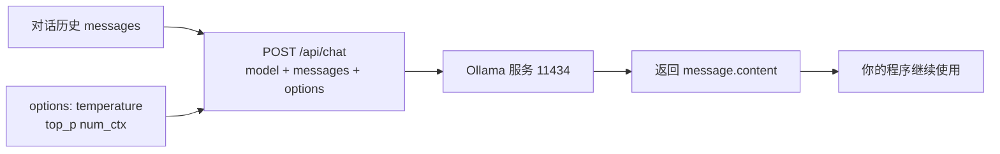

# 第四十七讲 · 大模型超参调整 / Chatbox / 代码与 Ollama 交互

> **本讲信息**
> - 日期：2026-09-29（周二）
> - 第几讲：第四十七讲（学习计划 Day 47，P9）
> - 对应计划：`study-plan-60d.md` → **P9**，课程集号 **178–180**
> - 今日目标：从“在命令行里聊天”升级到**“用代码调模型”**——这样才能把大模型塞进你的机器人程序里。同时搞懂两个最常用的**超参数**（temperature / top_p）该怎么调。

---

## 0. 一句话总结

> **temperature 控“敢不敢瞎想”，top_p 控“候选词范围”：做机器人指令解析要低温（确定、可复现），做创意闲聊可高温。** 而用代码调用 Ollama，本质就是往 `http://localhost:11434` 发一个带 model 和 messages 字段的 HTTP 请求。

---

## 1. 核心知识点（对照 178–180）

### 1.1 178 大模型超级参数的调整
- **temperature（温度）**：控制输出的随机性。
  - 越低（如 0.1）→ 越确定、越死板，**同样问题答案稳定**；
  - 越高（如 1.0 以上）→ 越发散、越有“创意”，但**容易跑偏、胡说**。
- **top_p（核采样）**：只从累计概率达到 top_p 的候选词里挑（如 0.9 表示只考虑前 90% 概率质量的词）。
- **经验取值**：
  - 指令解析 / 结构化输出 → **temperature 0～0.3**（要稳定）；
  - 闲聊 / 创意生成 → 0.7～1.0。
- 还有 `num_ctx`（上下文长度，Day 46 提过）、`num_predict`（最大生成长度）等。

### 1.2 179 Chatbox 的安装和使用
- **Chatbox** 是一套图形界面客户端，可以连 Ollama / 各种 API，比命令行舒服。
- 配置要点：选好接口类型（Ollama）、填对**地址与端口**（默认 `http://localhost:11434`）、选模型。

### 1.3 180 代码与 Ollama 交互
- Ollama 提供 HTTP API，最常用的是聊天接口 `POST /api/chat`。
- 请求体核心两项：`model`（模型名）和 `messages`（对话历史，每条含 role 与 content）。
- 用 Python 的 requests 库或官方 ollama 库都能调；返回里取 `message.content` 就是回复文本。
- **对话记忆靠自己维护**：把历史 messages 一起发过去，它才“记得”上文（呼应 Day 44 的“没有记忆”缺陷）。

---

## 2. 原理（先抓这几条）

1. **temperature 低 → 确定；高 → 发散**。机器人控制场景要低温。
2. **Ollama 就是个本地 HTTP 服务**，代码调用 = 发 POST 请求。
3. **记忆是你在 messages 里传出来的**，模型本身不保存历史。

---

## 3. 一张图：代码怎么调 Ollama

---

## 4. 今天的操作步骤

1. **看 178–180**（1.0–1.5 倍速），重点看 178 两个超参的效果对比、180 请求怎么发。
2. **用 Chatbox 连上 Ollama**，图形界面里聊两句，确认地址/端口配置正确。
3. **写一个 chat 函数**：参数是 prompt 与 history，内部用 requests 调 `/api/chat`，返回回复文本。
4. **对比 temperature 取 0.1 与 1.0**：同一个问题各问 3 次，观察答案稳定性差异。
5. **实现多轮记忆**：把历史拼进 messages，验证它现在能回答“我上一句说了什么”。
6. **加超时与异常处理**：服务没启动时给出清晰报错（复用 Day 44 的 try/except）。
7. **镜子测试（3 分钟）：** *“temperature 低/高分别___；机器人指令场景该取多少___；代码调 Ollama 本质是什么___；记忆怎么实现___。”*

> **今天“做完”的标准：** 代码能调通 Ollama + 多轮记忆生效 + 会调 temperature + 过镜子测试。

---

## 5. 常见误区 & 容易踩的坑

| # | 误区 | 真相 |
|---|---|---|
| 1 | temperature 越高越好 | 机器人控制场景高温度 = 指令不稳定，容易出事故 |
| 2 | 以为模型自己会记历史 | 每次请求都要把 history 一起发过去 |
| 3 | 地址/端口写错 | Ollama 默认 11434，写错或被防火墙挡 → 连不上 |
| 4 | 不加超时 | 模型卡住时程序一直挂着 |
| 5 | 把超参写死 | 不同用途（解析 vs 闲聊）要用不同参数 |

---

## 6. DEA 交叉链接（轻量，非主线）

- 用大模型解析“把薄膜轻轻鼓起”这类指令时，**temperature 必须低**——因为输出会被翻译成电压，随机性就等于安全隐患。
- 更稳的做法：让模型只输出**结构化参数**（例如 JSON 形式的电压值与持续时长），再由你的程序做**范围校验**后才下发。这条“模型输出 → 结构化 → 校验 → 执行”的护栏思路，是软体 + 大模型落地的关键。

---

## 7. 下一阶段 / 检查点

- **过了检查点 =** 代码调通 Ollama + 多轮记忆 + 会调超参 + 过镜子测试。
- **下一阶段（Day 48）：** 网页聊天助手 / 带 GUI 的聊天助手（181–182）。

---

### 参考资料（先放着，今天不要求）
- 课程集号 178–180（B 站《黑马程序员 · 具身智能》）。
- 复用：Day 44（无记忆缺陷）、Day 46（Ollama 本地服务）。

*本讲严格对应《60 天计划》Day 47（P9）：178–180。全程零军事内容。*
