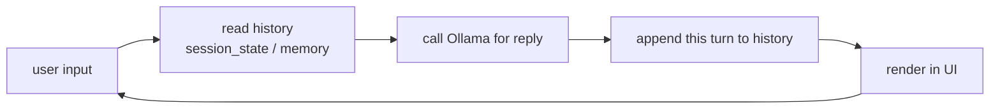

# Lecture 48 · Web Chat Assistant / GUI Chat Assistant

> **Lecture info**
> - Date: 2026-09-30 (Wed)
> - Lecture #: 48 (Study Plan Day 48, P9)
> - Plan ref: `study-plan-60d.md` → **P9**, episodes **181–182**
> - Goal: Put an **interface** on the local LLM you already have running — first a web version (Streamlit is the least effort), then a desktop GUI version. The UI isn’t decoration; it’s the prototype of the **robot human-machine panel** you’ll build later.

---

## 0. One-line summary

> **Streamlit gives you a web chat UI in a few dozen lines of Python** — the crux is `st.session_state` for conversation history, otherwise the script re-runs on every interaction and history vanishes. A GUI version (Tkinter / PyQt) is the desktop form, but the essence is the same: **UI = input + call + display + state management**.

---

## 1. Core concepts (eps 181–182)

### 1.1 181 Building an interactive web chat assistant
- **Streamlit**: a minimal web framework for data/AI apps — `pip install streamlit`, then `streamlit run app.py`.
- Three key pieces:
  1. `st.chat_input()` for user input;
  2. call Ollama (the chat function from Day 47);
  3. render bubbles with `st.chat_message()`.
- **State management is the core trap**: Streamlit **re-runs the whole script on every interaction**, so history must live in `st.session_state`.

### 1.2 182 A GUI chat assistant
- Desktop options: Tkinter (bundled with Python, zero dependencies) / PyQt (prettier).
- Components: input box + send button + transcript area (Text/Listbox) + **a background thread for the model call** (so the UI doesn’t freeze).
- ⚠️ **Never run inference on the main thread** — the window freezes; use a thread or async.

---

## 2. Principles (grab these)

1. **Web = state management** (session_state); **GUI = threading** (don’t block the UI).
2. **The UI is only a shell**: the real logic is still Day 47’s “messages → call Ollama → get reply”.
3. **You store the history**: no matter the interface, the model doesn’t remember for you.

---

## 3. One diagram: the generic UI layer

---

## 4. Today’s steps

1. **Watch 181–182** (1.0–1.5×), focus on 181 (session_state) and 182 (why a thread).
2. **Install Streamlit** and run a minimal demo (input + echo), confirm the page opens.
3. **Wire in Ollama**: input → model call → display reply.
4. **Add history rendering**: store in session_state so it survives across turns.
5. **Add a temperature slider** and feel its effect live (Day 47 knowledge).
6. **Optional GUI version**: Tkinter input + text area; run the model in a background thread and verify the UI stays responsive.
7. **Mirror test (3 min):** *“Why Streamlit needs session_state ___; why a GUI needs a thread ___; the four steps of the UI layer ___.”*

> **Done today when:** the web chat assistant works + history persists + mirror test passed.

---

## 5. Common pitfalls

| # | Myth | Truth |
|---|---|---|
| 1 | Store history in a plain variable | Streamlit re-runs the script each time → history wiped; must use session_state |
| 2 | Call the model on the main thread | The UI freezes for seconds; terrible experience |
| 3 | Port conflict | Default 8501 already taken → startup fails; change with `--server.port` |
| 4 | Rebuild the history object per request | Context is lost or duplicated; maintain exactly one copy |
| 5 | Fancy UI, messy state | Get the state right first, then beautify |

---

## 6. DEA cross-link (light, not main thread)

- This interface is basically the seed of a **soft-robotics experiment control panel**: replace the “input box” with a “target deformation slider” and the “reply” with “voltage command + live displacement curve”, and you have a soft-actuation HMI.
- Soft experiments especially need **live plots plus an emergency stop** — when building the UI, make “safety stop” the most prominent control. That’s something rigid-arm interfaces rarely need but soft setups always do.

---

## 7. Next / checkpoint

- **Checkpoint passed =** web chat assistant works + history persists + mirror test.
- **Next (Day 49):** MCP — Model Context Protocol (183–186), **giving the LLM real hardware-control ability**.

---

### References (not required today)
- Episodes 181–182 (B站《黑马程序员 · 具身智能》).
- Reuse: Day 47 (calling Ollama from code), Day 10 (WebSocket push — you’ll need it for robot panels).

*This lecture strictly follows 《60-Day Plan》 Day 48 (P9): 181–182. Zero military content.*
