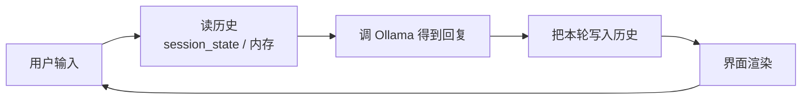

# 第四十八讲 · 网页聊天助手 / GUI 版聊天助手

> **本讲信息**
> - 日期：2026-09-30（周三）
> - 第几讲：第四十八讲（学习计划 Day 48，P9）
> - 对应计划：`study-plan-60d.md` → **P9**，课程集号 **181–182**
> - 今日目标：给已经能跑的本地大模型**套一层界面**——先做网页版（Streamlit 最省事），再做桌面 GUI 版。界面不是花架子，它是后面**机器人人机交互面板**的雏形。

---

## 0. 一句话总结

> **Streamlit 让你用几十行 Python 就拥有一个网页聊天界面**——核心是 `st.session_state` 保存对话历史，否则每次交互页面重跑、历史全丢。GUI 版（如 Tkinter / PyQt）则是桌面形态，本质一样：**界面 = 输入 + 调用 + 显示 + 状态管理**。

---

## 1. 核心知识点（对照 181–182）

### 1.1 181 开发一个交互的网页聊天助手
- **Streamlit**：专给数据/AI 应用用的极简 Web 框架，`pip install streamlit`，`streamlit run app.py` 即启动。
- 关键三件事：
  1. `st.chat_input()` 拿用户输入；
  2. 调 Ollama（Day 47 的 chat 函数）；
  3. 用 `st.chat_message()` 渲染气泡。
- **状态管理是核心坑**：Streamlit 每次交互都会**从上到下重跑整个脚本**，所以历史必须存在 `st.session_state` 里。

### 1.2 182 带 GUI 的黑马聊天助手
- 桌面 GUI 方案：Tkinter（Python 自带、零依赖）/ PyQt（更漂亮）。
- 组成：输入框 + 发送按钮 + 聊天记录区（Text/Listbox）+ **后台线程调模型**（避免界面卡死）。
- ⚠️ **别在主线程里跑模型推理**——界面会假死，必须开线程或异步。

---

## 2. 原理（先抓这几条）

1. **Web 版核心是状态管理**（session_state），**GUI 版核心是线程**（别卡界面）。
2. **界面只是壳**：真正的逻辑还是 Day 47 那套“messages → 调 Ollama → 拿回复”。
3. **历史要自己存**：无论哪种界面，模型都不替你记。

---

## 3. 一张图：界面层的通用结构

---

## 4. 今天的操作步骤

1. **看 181–182**（1.0–1.5 倍速），重点看 181 session_state 怎么存历史、182 为什么开线程。
2. **装 Streamlit**，跑一个最小 demo（输入框 + 回显），确认能打开网页。
3. **把 Ollama 接进来**：输入 → 调模型 → 显示回复。
4. **加历史显示**：用 session_state 保存，刷新/多轮后历史不丢。
5. **加一个 temperature 滑块**，实时感受参数对回复的影响（Day 47 知识）。
6. **（可选）做 GUI 版**：Tkinter 输入框 + 文本框；把模型调用放后台线程，验证界面不卡。
7. **镜子测试（3 分钟）：** *“Streamlit 为什么要用 session_state___；GUI 为什么要开线程___；界面层的四步是___。”*

> **今天“做完”的标准：** 网页聊天助手能用 + 历史不丢 + 过镜子测试。

---

## 5. 常见误区 & 容易踩的坑

| # | 误区 | 真相 |
|---|---|---|
| 1 | 历史存在普通变量里 | Streamlit 每次都重跑脚本 → 历史清空，必须用 session_state |
| 2 | 在主线程调模型 | 界面假死几秒甚至更久，体验极差 |
| 3 | 端口冲突 | 默认 8501 被占用 → 启动失败，换 `--server.port` |
| 4 | 每次请求都重建历史对象 | 上下文丢失或重复叠加，要统一维护一份 |
| 5 | 界面做得花里胡哨但状态乱 | 先把状态管对，再谈美化 |

---

## 6. DEA 交叉链接（轻量，非主线）

- 这个界面其实就是软体实验**控制面板的雏形**：把“输入框”换成“目标形变滑条”、把“回复”换成“电压指令与实时位移曲线”，就是一套软体驱动的人机界面。
- 软体实验尤其需要**实时曲线显示 + 紧急断电按钮**——做界面时把“安全停止”做成最显眼的控件，这是刚性臂界面不常见但软体必备的。

---

## 7. 下一阶段 / 检查点

- **过了检查点 =** 网页聊天助手能用 + 历史不丢 + 过镜子测试。
- **下一阶段（Day 49）：** MCP 模型上下文协议（183–186）——**让大模型真正拥有控制硬件的能力**。

---

### 参考资料（先放着，今天不要求）
- 课程集号 181–182（B 站《黑马程序员 · 具身智能》）。
- 复用：Day 47（代码调 Ollama）、Day 10（WebSocket 实时推送，做机器人面板时会再用到）。

*本讲严格对应《60 天计划》Day 48（P9）：181–182。全程零军事内容。*
