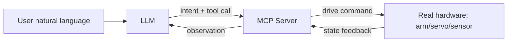
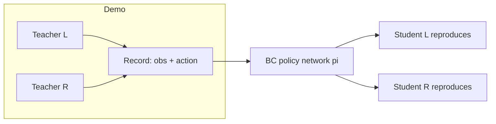

# MCP Effect Demo and ALOHA Bimanual Teleop Intro

> **阶段**：P9 / P10 ｜ **今日课程**：187–188
> **日期**：2026-10-02 ｜ **Day 50 / 60**
> 本篇为《黑马程序员·具身智能》223 节配套复习笔记，零基础可读、不失专业；含流程图与易错点。

## 一、今日课程（集号映射）

- **187 Target effect showcase**: Run the MCP (Model Context Protocol) hardware-control demo built earlier, showing the end-to-end effect "one sentence to the LLM → the robot arm moves".
- **188 Stanford ALOHA robot intro**: ALOHA is Stanford's open-source bimanual teleoperation + imitation-learning benchmark, and the methodological source of the "Behavior Cloning (BC)" we study next.

## 二、核心知识点（零基础讲透）

### 2.1 MCP hardware-control effect demo
The earlier MCP lessons connected "LLM" and "real hardware" through one standard protocol: **the LLM understands intent, the MCP Server translates intent into hardware calls** (read values, send angles, blink lights…). Today we make the whole loop work and confirm "speak naturally → robot executes" holds.

### 2.2 What ALOHA is (focus on the "methodology")
ALOHA = **two teacher arms + two student arms** bimanual robot:
- A human wears the teacher arms to demonstrate → teacher joint angles are recorded;
- The student arms follow the teacher angles, i.e. "copy the homework";
- Collect many (observation image, teacher→student angle) pairs → train a policy network so the student arms **autonomously** reproduce the demo → this is the seed of Behavior Cloning (BC).

**Key insight**: ALOHA's value is not "it has four arms" but the transferable "**leader-follower + demonstration + behavior cloning**" framework — you can apply the same "collect demos → learn demos" loop to a single arm, a soft gripper, or DEA actuators.

## 三、动手操作（跑通才算学会）

1. Review the MCP flow: open the MCP Server you wired earlier, say one natural sentence and make the hardware move, confirm the link works.
2. Watch the ALOHA bimanual demo video, draw the "teacher arm → recording → student arm" data flow on paper.
3. Write one sentence: if ALOHA's methodology moves to "single arm + soft gripper", what are the demo data and the action?

## 四、易错点（前人踩过的坑）

- **Thinking ALOHA requires two real arms**: wrong — the core is the "leader-follower + demonstration + BC" method, transferable to a single arm or even soft actuators.
- **Treating the MCP demo as "learned"**: demo working ≠ understanding the protocol layers (LLM/Server/hardware); be able to state each layer's job.
- **Remembering only the name, not the pipeline**: interviews often ask "where does BC data come from" — the answer is teleop collection like ALOHA.

## 五、DEA / 软体机器人交叉链接（轻量）

For DEA soft grippers doing "demonstration + BC", the action space is not rigid joint angles but **voltage/electric-field driven shape change**; ALOHA's "leader-follower alignment" transfers to: manually bend the soft hand → record driving voltage → train BC to reproduce. This is a light cross-link; the main line stays generic BC.

## 六、今日小结 & 镜子复述 3 分钟

Today we ran the MCP hardware demo and met ALOHA — the benchmark of "leader-follower teleop + behavior cloning". Remember: **BC's data comes from humans demonstrating while the machine records; ALOHA is the open-source scheme that standardizes this demo-data collection**. Next: P10, formal Behavior Cloning.

> 说明：本系列为通用具身智能学习笔记（不是军事专题）。DEA（介电弹性体驱动器）仅作与本人研究方向的轻量交叉，不展开、不占主线。
