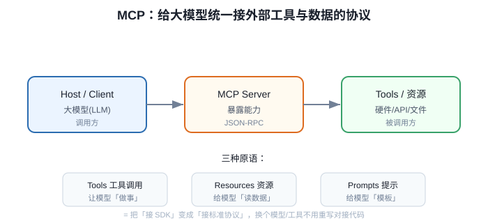
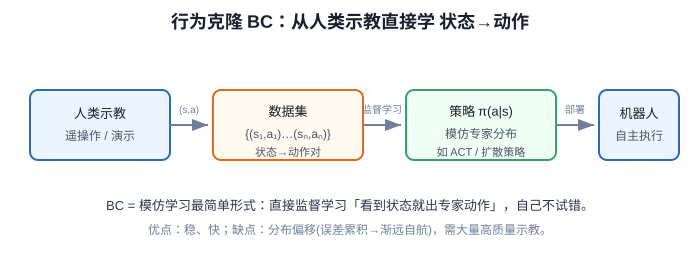

# MCP 效果展示与 ALOHA 双臂遥操作介绍

> **阶段**：P9 / P10 ｜ **今日课程**：187–188
> **日期**：2026-10-02 ｜ **Day 50 / 60**
> 本篇为《黑马程序员·具身智能》223 节配套复习笔记，零基础可读、不失专业；含流程图与易错点。

## 一、今日课程（集号映射）

- **187 目标效果展示**：把前面学过的 MCP（模型上下文协议）控硬件跑通一遍，看“大模型一句话 → 机械臂动起来”的端到端效果。
- **188 斯坦福 ALOHA 机器人的介绍**：ALOHA 是斯坦福开源的双手机器人遥操作 + 模仿学习标杆，也是后面“行为克隆 BC”的方法论来源。

## 二、核心知识点（零基础讲透）

### 2.1 MCP 控硬件的效果展示
前几天的 MCP 已经把“大模型”和“真实硬件”用一套标准协议接起来：**大模型负责理解意图，MCP Server 负责把意图翻译成对硬件的调用**（读数、发角度、点灯……）。今天把整套流程跑顺，确认“说人话 → 机器人执行”成立。

### 2.2 ALOHA 是什么（重点理解“方法论”）
ALOHA = **两台主臂（teacher）+ 两台从臂（student）** 的双手机器人：
- 人戴着主臂做示范 → 主臂角度被记录下来；
- 从臂跟着主臂的角度走，等于“抄作业”；
- 把大量“(观测图像, 主臂角度→从臂角度)”配对收集起来，就能训练一个策略网络让从臂**自己**复现示范 → 这就是行为克隆 BC 的雏形。

**关键认知**：ALOHA 的价值不在“它有四只胳膊”，而在“**主从 + 示教 + 行为克隆**”这套可被迁移的方法论——你后面用单臂、用软体手、用 DEA 执行器，都能套同一套“采集示范→学示范”的框架。

## 2.5 补充细节：ALOHA 双臂遥操作与 MCP 演示

- ALOHA 是一套双臂遥操作(teleop)硬件：人戴主臂示范，从臂跟随，用来采集高质量双手操作示教数据。
- **Action Chunking（动作块 / ACT 技术）**：ALOHA 后续提出的 ACT（Action Chunking Transformer）核心思想是**一次预测未来一整段动作序列（一个“动作块”）而非逐单步动作**，降低双臂时序误差累积、提升协调稳定性——这正是 Day 10-03 提到的“advanced methods like ACT (Action Chunking Transformer)”所指向的具体技术。
- 它和 BC 的关系：遥操作采集的 (状态,动作) 对，正是行为克隆(见 Day 10-03)的训练原料。
- MCP 在演示里的作用：把机械臂/夹爪/相机等封装成标准 Tool，让上层大模型或脚本用统一接口下发指令、读回状态。
- 一句话串起来：MCP 管「能不能方便调设备」→ 遥操作管「采到好数据」→ BC 管「从数据学出策略」。

## 3. 一张图

MCP 控硬件闭环：

ALOHA 主从遥操作 → 行为克隆数据流：

## 三、动手操作（跑通才算学会）

1. 回顾 MCP 全流程：打开你之前接好的 MCP Server，用一句自然语言让硬件动一下，确认链路通。
2. 看 ALOHA 双手机器人演示视频，在纸上画出“主臂→录制→从臂”的数据流。
3. 思考并写一句话：ALOHA 的方法论如果搬到“单臂 + 软体手”上，示范数据和动作分别是什么？

## 四、易错点（前人踩过的坑）

- **以为 ALOHA 必须真有两台臂**：错，核心是“主从 + 示教 + BC”方法论，可迁移到单臂甚至软体执行器。
- **把 MCP 演示当“学会了”**：演示跑通 ≠ 理解协议分层（LLM/Server/硬件），要把三层职责说清楚才算懂。
- **只记 ALOHA 名字不记链路**：考试/面试常问“BC 的数据从哪来”，答案就是 ALOHA 这种遥操作采集。

## 五、DEA / 软体机器人交叉链接（轻量）

DEA 软体手做“示教 + 行为克隆”时，动作空间不是刚性关节角，而是**电压/电场驱动的形状变化**；ALOHA 的“主从对齐”思路可迁移为：人手动掰动软体手成形 → 记录驱动电压 → 训练 BC 复现。这只是交叉联想，主线仍是通用 BC。

## 六、今日小结 & 镜子复述 3 分钟

今天把 MCP 控硬件跑通看效果，并认识 ALOHA——它是“主从遥操作 + 行为克隆”的标杆。记住一句话：**BC 的数据来自人做示范、机器记录，ALOHA 就是把这套示范数据采集标准化的开源方案**。下一步进入 P10，正式学行为克隆 BC。

> 说明：本系列为通用具身智能学习笔记（不是军事专题）。DEA（介电弹性体驱动器）仅作与本人研究方向的轻量交叉，不展开、不占主线。
