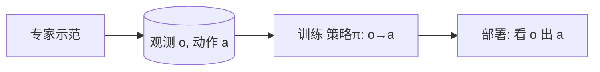

# 端到端行为克隆与 RL/BC 概念辨析

> **阶段**：P10 ｜ **今日课程**：189–190
> **日期**：2026-10-03 ｜ **Day 51 / 60**
> 本篇为《黑马程序员·具身智能》223 节配套复习笔记，零基础可读、不失专业；含流程图与易错点。

## 一、今日课程（集号映射）

- **189 端到端行为克隆技术的演示**：直接看 BC 怎么把“看画面 → 出动作”端到端学出来。
- **190 强化学习和行为克隆概念介绍**：第一次正式区分 BC 与 RL 这两条“让机器学会做事”的路线。

## 二、核心知识点（零基础讲透）

### 2.1 行为克隆 BC = 你示范、它学你
BC 是模仿学习最朴素的形式：**把专家（你）的示范当成监督标签，训练一个网络去复制专家动作**。
- 输入：观测（相机画面、机器人状态）
- 输出：动作（关节角、电压、位移）
- 本质：**监督学习**（有标准答案 = 专家动作）

### 2.2 BC vs RL（60 天最重要的一个对比）
| 维度 | 行为克隆 BC | 强化学习 RL |
|------|------------|------------|
| 学习信号 | 专家动作（有标签） | 环境奖励（无标签） |
| 学习方式 | 监督学习，复制示范 | 自己试错，最大化累计奖励 |
| 是否需专家 | 需要人/专家示范 | 不需要，给奖励即可 |
| 能否超过专家 | 难（上限≈专家） | 可能（探索出更好策略） |
| 典型问题 | 分布偏移、示范覆盖不全 | 奖励设计难、训练不稳定 |

一句话：**BC 是“抄作业”，RL 是“自己刷题找最优解”**。

## 三、动手操作（跑通才算学会）

1. 看 BC 端到端演示，确认“输入画面、输出动作”长什么样。
2. 在笔记本上写一句话区分 BC 与 RL（这是 60 天最重要的对比点，面试常考）。
3. 预判：BC 最大的隐患是什么？（提示：示范没覆盖的情况，网络会乱出动作 → 分布偏移）

## 四、易错点（前人踩过的坑）

- **以为 BC = RL**：错。BC 是监督学习（有专家动作标签），RL 没有现成标签、只有奖励信号。
- **以为 BC 能超过专家**：BC 上限约等于示范质量，想超越要靠 RL 或加探索。
- **忽略分布偏移**：BC 训练时看的是“专家见过的观测”，部署时遇到新观测会犯错——这是 BC 的核心难题。

## 五、DEA / 软体机器人交叉链接（轻量）

DEA 软体手用 BC 时，“动作标签”是驱动电压序列而非刚性角；分布偏移表现为“电压组合没见过→形变不可控”。交叉联想即可，主线是通用 BC 与 RL 概念。

## 六、今日小结 & 镜子复述 3 分钟

今天确立 60 天最重要的一组对比：**BC=抄作业（监督、有专家标签），RL=自己刷题（无标签、靠奖励）**。BC 简单但受限于示范、有分布偏移；RL 上限高但难训。后面几天就用 ALOHA 那套“采集示范”把 BC 真正跑通。

> 说明：本系列为通用具身智能学习笔记（不是军事专题）。DEA（介电弹性体驱动器）仅作与本人研究方向的轻量交叉，不展开、不占主线。
