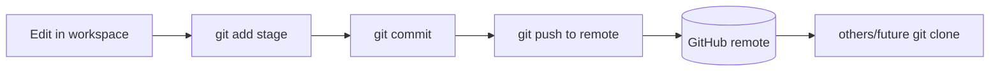

# Git Version Control and genkiarm Open-Source Arm Setup

> **阶段**：P10 ｜ **今日课程**：191–193
> **日期**：2026-10-04 ｜ **Day 52 / 60**
> 本篇为《黑马程序员·具身智能》223 节配套复习笔记，零基础可读、不失专业；含流程图与易错点。

## 一、今日课程（集号映射）

- **191 Install Git VCS**: install Git to manage code versions.
- **192 Download & install genkiarm source**: clone the open-source arm project genkiarm.
- **193 Complete open-source project device config**: configure device config (port, ID…) per docs.

## 二、核心知识点（零基础讲透）

### 2.1 Why Git
BC means repeatedly editing code, collecting data, training models. **Git lets you "go back to yesterday's working version"**, avoiding unrecoverable breakage. Core: repo, commit, branch, remote.

### 2.2 What genkiarm is
genkiarm is an open-source robot-arm project (control code, calibration scripts, data-collection tools) perfect for running the full BC loop: clone → env → device config → calibrate → collect → train. Today we finish "clone + device config".

**Device config tips**: set the correct port (COM3 / /dev/ttyUSB0), servo/motor ID, baud rate — otherwise the program can't reach the hardware.

## 三、动手操作（跑通才算学会）

1. Install Git, configure user name and email (`git config --global user.name/user.email`).
2. `git clone` the genkiarm repo locally.
3. Configure device config (port, ID) per README, confirm you can reach the hardware.

## 四、易错点（前人踩过的坑）

- **Git lacks user.name/email → commit fails**: must `git config` before first commit.
- **Wrong device ID/port in config → no hardware**: check the port in Device Manager before filling.
- **Editing main directly without a branch**: prefer `git checkout -b dev` for BC code so a crash doesn't hurt the main line.

## 五、DEA / 软体机器人交叉链接（轻量）

For DEA soft-actuator control, also use Git to manage drive/collection code; device config holds DAQ board channels and HV-driver addresses — same idea as genkiarm. Light cross-link.

## 六、今日小结 & 镜子复述 3 分钟

Today we laid BC's engineering foundation: install Git for versioning, clone the genkiarm open-source arm, configure device config. Next: proxy + teacher-arm calibration — the key to BC data quality.

> 说明：本系列为通用具身智能学习笔记（不是军事专题）。DEA（介电弹性体驱动器）仅作与本人研究方向的轻量交叉，不展开、不占主线。
