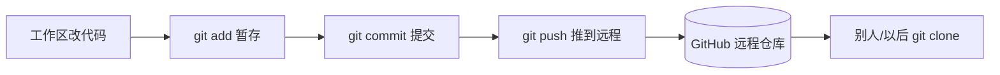

# Git 版本控制与开源机械臂项目 genkiarm 安装

> **阶段**：P10 ｜ **今日课程**：191–193
> **日期**：2026-10-04 ｜ **Day 52 / 60**
> 本篇为《黑马程序员·具身智能》223 节配套复习笔记，零基础可读、不失专业；含流程图与易错点。

## 一、今日课程（集号映射）

- **191 版本控制软件 GIT 的安装**：装 Git，管理代码版本。
- **192 genkiarm 源码下载和安装**：克隆开源机械臂项目 genkiarm。
- **193 完成开源项目 config 设备的配置**：按文档配好设备 config（串口号、ID 等）。

## 二、核心知识点（零基础讲透）

### 2.1 为什么要 Git
BC 要反复改代码、采集数据、训练模型，**Git 让你可以“回到昨天的可用版本”**，避免改崩了找不回。核心概念：仓库(repo)、提交(commit)、分支(branch)、远程(remote)。

### 2.2 genkiarm 是什么
genkiarm 是一个开源机械臂项目（含控制代码、标定脚本、数据采集工具），正好用来跑通 BC 全流程：克隆 → 配环境 → 配设备 → 标定 → 采集 → 训练。今天完成“克隆 + 配设备”两步。

**配置 device config 要点**：填对串口号（如 COM3 / /dev/ttyUSB0）、舵机/电机 ID、波特率，否则程序连不上硬件。

## 三、动手操作（跑通才算学会）

1. 安装 Git，配置用户名和邮箱（`git config --global user.name/user.email`）。
2. `git clone` genkiarm 仓库到本地。
3. 按项目 README 配好 device config（串口、ID），确认能连上硬件。

## 四、易错点（前人踩过的坑）

- **Git 没配用户名邮箱 → 提交失败**：第一次 commit 前必须 `git config`。
- **config 设备 ID/串口写错 → 连不上硬件**：先确认设备管理器里的串口号再填。
- **直接改 main 分支不建分支**：建议 `git checkout -b dev` 另开分支改 BC 代码，炸了不影响主线。

## 五、DEA / 软体机器人交叉链接（轻量）

做 DEA 软体执行器控制时，同样用 Git 管理驱动/采集代码；device config 里填的是 DAQ 板卡通道与高压驱动地址，思路与 genkiarm 一致。轻量交叉。

## 六、今日小结 & 镜子复述 3 分钟

今天铺垫 BC 的工程地基：装 Git 管理版本、克隆 genkiarm 开源机械臂项目、配好设备 config。下一步是代理与 teacher 主臂标定——BC 数据质量的关键。

> 说明：本系列为通用具身智能学习笔记（不是军事专题）。DEA（介电弹性体驱动器）仅作与本人研究方向的轻量交叉，不展开、不占主线。
