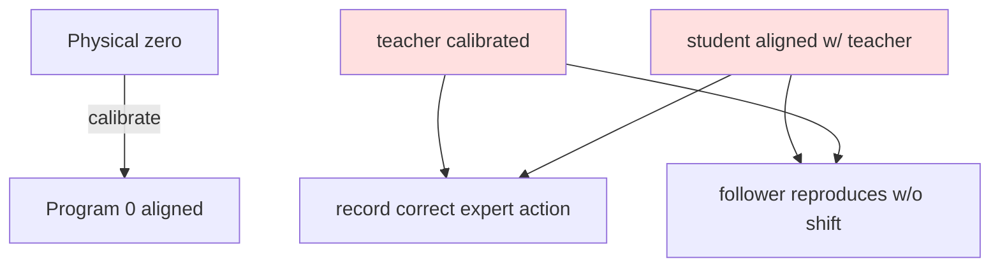

# Proxy Setup and Teacher Arm Calibration with Dual-Side Alignment

> **阶段**：P10 ｜ **今日课程**：194–196
> **日期**：2026-10-05 ｜ **Day 53 / 60**
> 本篇为《黑马程序员·具身智能》223 节配套复习笔记，零基础可读、不失专业；含流程图与易错点。

## 一、今日课程（集号映射）

- **194 Install proxy**: configure a proxy for downloading deps / accessing external resources.
- **195 VERY important teacher-side calibration**: teacher-arm calibration must be accurate — the premise of correct BC data.
- **196 VERY important: check teacher & student angle calibration**: teacher and student (follower) angle calibrations must align.

## 二、核心知识点（零基础讲透）

### 2.1 Why a proxy
Many dependencies (PyTorch, simulators, pretrained weights) are slow or blocked domestically; a **proxy** routes your machine through a faster channel. With it set, installing packages and downloading models later goes smoothly.

### 2.2 teacher / student calibration (today's top priority)
In ALOHA-style BC:
- **teacher (leader) arm**: worn by a human to demonstrate; its angles = ground truth (expert action labels);
- **student (follower) arm**: learns from teacher, finally reproduces autonomously.

**Calibration = align the arm's physical zero with the program's 0°**. If teacher is mis-calibrated, the recorded "expert action" is wrong; if teacher and student are not aligned, the follower learns "wrong teacher angles" and shifts overall at deploy.

**The course marks 195/196 "VERY important" twice** — this is the make-or-break point for whether BC works.

## 三、动手操作（跑通才算学会）

1. Set up the proxy (env vars or tool), confirm you can install packages.
2. Calibrate the teacher leader arm, confirm zero alignment.
3. Check teacher & student angle calibration align (course priority); record a short clip to verify both arms move consistently.

## 四、易错点（前人踩过的坑）

- **teacher/student mis-aligned → cloned action shifts overall** (course priority): align both sides before collecting.
- **No proxy → deps won't download**: if install hangs, check the proxy first.
- **Calibrate once = forever accurate**: moving the arm or power loss can drift the zero; re-verify before formal collection.

## 五、DEA / 软体机器人交叉链接（轻量）

For DEA soft grippers doing leader-follower demonstration, the calibration target is the **voltage↔deformation map**; teacher forms manually, student records voltage, alignment = "same deformation ↔ same voltage". Light cross-link.

## 六、今日小结 & 镜子复述 3 分钟

Today's focus is calibration: the proxy ensures deps download, teacher-arm calibration must be accurate, and teacher/student angles must align — otherwise BC data is wrong at the source. This is BC's make-or-break point; do it solidly.

> 说明：本系列为通用具身智能学习笔记（不是军事专题）。DEA（介电弹性体驱动器）仅作与本人研究方向的轻量交叉，不展开、不占主线。
