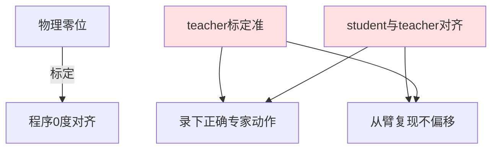

# 代理设置与 teacher 主臂标定及双端对齐（重点）

> **阶段**：P10 ｜ **今日课程**：194–196
> **日期**：2026-10-05 ｜ **Day 53 / 60**
> 本篇为《黑马程序员·具身智能》223 节配套复习笔记，零基础可读、不失专业；含流程图与易错点。

## 一、今日课程（集号映射）

- **194 安装代理设置**：配置代理，方便下载依赖 / 访问外网资源。
- **195 非常重要非常重要 teacher 端标定**：主臂（teacher）标定必须准，这是 BC 数据准确的前提。
- **196 非常重要，检查 teacher 和 student 的角度标定**：teacher 与 student（从臂）角度标定要互相对齐。

## 二、核心知识点（零基础讲透）

### 2.1 为什么要代理
很多依赖（PyTorch、仿真器、预训练权重）在国内直连慢或下不动，**代理**让你的机器走一条更快的通道。配好代理，后面装包、下模型才顺。

### 2.2 teacher / student 标定（今天的重点中的重点）
ALOHA 式 BC 里：
- **teacher（主臂）**：人戴着做示范，它的角度 = 标准答案（专家动作标签）；
- **student（从臂）**：要学 teacher，最后自主复现。

**标定 = 让“臂的物理零位”和“程序里的 0 度”对齐**。如果 teacher 没标定准，录下来的“专家动作”本身就偏；如果 teacher 和 student 没对齐，从臂学的是“错的主臂角度”，部署时整体偏移。

**课程把 195/196 标“非常重要”两次**，说明这是 BC 能不能跑通的分水岭。

## 三、动手操作（跑通才算学会）

1. 配好代理（环境变量或工具），确认能下包。
2. 做 teacher 主臂标定，确认零位对齐。
3. 检查 teacher 与 student 角度标定互相对齐（课程重点），录一小段验证两端动作一致。

## 四、易错点（前人踩过的坑）

- **teacher/student 标定没对齐 → 克隆动作整体偏移**（课程列的重点）：必须双端对齐再采集。
- **代理没设 → 依赖下不动**：装包卡住先查代理。
- **标定一次就永远准**：机械臂挪动、断电后零位可能漂，正式采集前再校验一次。

## 五、DEA / 软体机器人交叉链接（轻量）

DEA 软体手做“主从示教”时，标定对象是**驱动电压↔形变的映射曲线**；teacher 手动成形、student 记录电压，双端对齐即“同形变↔同电压”。轻量交叉。

## 六、今日小结 & 镜子复述 3 分钟

今天的重点是标定：代理保证依赖能下，teacher 主臂标定必须准，且 teacher 与 student 角度要互相对齐——否则 BC 数据从源头就偏。这是 BC 跑通的分水岭，务必做扎实。

> 说明：本系列为通用具身智能学习笔记（不是军事专题）。DEA（介电弹性体驱动器）仅作与本人研究方向的轻量交叉，不展开、不占主线。
