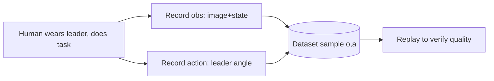

# Teleop Check and BC Dataset Recording and Replay

> **阶段**：P10 ｜ **今日课程**：197–200
> **日期**：2026-10-06 ｜ **Day 54 / 60**
> 本篇为《黑马程序员·具身智能》223 节配套复习笔记，零基础可读、不失专业；含流程图与易错点。

## 一、今日课程（集号映射）

- **197 Teleop check**: confirm teleop link works, leader-follower in sync.
- **198 Dataset recording**: record "demonstration" data (observation image/state → your action).
- **199 View recorded dataset**: inspect the recorded data.
- **200 Replay recorded action**: replay to verify data quality.

## 二、核心知识点（零基础讲透）

### 2.1 What BC data looks like
Each BC sample is a pair: **(observation o, action a)**.
- o: camera image + robot current state (angles/position)
- a: the action the expert (you) gave this instant (leader angle the follower should track)

Collection: human wears leader arm to do the task → simultaneously record "image+state" and "leader action" → store as dataset.

### 2.2 Why replay-check
Recording without checking = blind training. Replay reveals: action jumps, black frames, leader-follower desync, too few samples. **Data quality sets BC's ceiling** — don't skip this.

## 三、动手操作（跑通才算学会）

1. Teleop check: move the leader, confirm the follower tracks smoothly, no lag.
2. Record a simple task demo (e.g. move a block A→B).
3. View the dataset: confirm images exist, actions exist, sample count is reasonable.
4. Replay the recorded action, visually verify the follower trajectory is smooth and correct.

## 四、易错点（前人踩过的坑）

- **Recording scene ≠ deploy scene → poor generalization**: fix camera angle, lighting, object position as much as possible.
- **Too little data → BC overfits, action jitter**: record dozens to hundreds of demos per task.
- **Train without replay → dirty data into model**: replay is a zero-cost quality gate.

## 五、DEA / 软体机器人交叉链接（轻量）

For DEA soft grippers, add a "deformation outline image" to observations and use driving voltage as action; replay = re-apply voltage and check deformation consistency. Light cross-link.

## 六、今日小结 & 镜子复述 3 分钟

Today we actually produce BC's "raw material": verify teleop, record (observation, action) pairs, then replay to check quality. Remember: **BC's ceiling is set by data; replay-check is a zero-cost quality gate**.

> 说明：本系列为通用具身智能学习笔记（不是军事专题）。DEA（介电弹性体驱动器）仅作与本人研究方向的轻量交叉，不展开、不占主线。
