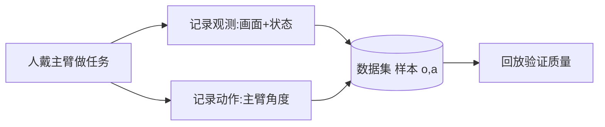

# 遥操作检查与行为克隆数据集录制回放

> **阶段**：P10 ｜ **今日课程**：197–200
> **日期**：2026-10-06 ｜ **Day 54 / 60**
> 本篇为《黑马程序员·具身智能》223 节配套复习笔记，零基础可读、不失专业；含流程图与易错点。

## 一、今日课程（集号映射）

- **197 遥操作检查**：确认遥操作链路通、主从同步。
- **198 数据集的录制操作**：录制“示教”数据（观测图像/状态 → 你做的动作）。
- **199 查看录制数据集的操作**：检查录下来的数据。
- **200 录制动作回放操作**：回放验证数据质量。

## 二、核心知识点（零基础讲透）

### 2.1 BC 的数据长什么样
BC 的每一条样本是配对：**(观测 o, 动作 a)**。
- 观测 o：相机拍到的画面 + 机器人当前状态（角度/位置）
- 动作 a：这一刻专家（你）给出的动作（主臂角度，从臂要去追）

采集流程：人戴主臂做任务 → 同时记录“画面+状态”和“主臂动作” → 存成数据集。

### 2.2 为什么要回放检查
录完不检查 = 盲训。回放能发现：动作跳变、画面黑屏、主从不同步、样本太少。**数据质量决定 BC 上限**，这一步省不得。

## 三、动手操作（跑通才算学会）

1. 遥操作检查：动主臂，确认从臂跟手、无卡顿。
2. 录制一段简单任务（如把方块从 A 移到 B）的示教数据。
3. 查看数据集：确认有图像、有动作、样本数合理。
4. 回放录制的动作，肉眼核对从臂轨迹是否顺滑正确。

## 四、易错点（前人踩过的坑）

- **录制时场景和部署时不一致 → 泛化差**：相机角度、光照、物体位置要尽量固定。
- **数据量太少 → BC 过拟合、动作抖**：一个任务至少录几十到上百条。
- **不回放就直接训 → 脏数据进模型**：回放是零成本的质量闸门。

## 五、DEA / 软体机器人交叉链接（轻量）

DEA 软体手采集时，观测可加“形变轮廓图”，动作是驱动电压；回放即重放电压看形变是否一致。轻量交叉。

## 六、今日小结 & 镜子复述 3 分钟

今天真正产出 BC 的“原料”：把遥操作链路查通，录制“(观测, 动作)”配对数据，再回放核验质量。记住：**BC 上限由数据决定，回放检查是零成本的质量闸门**。

> 说明：本系列为通用具身智能学习笔记（不是军事专题）。DEA（介电弹性体驱动器）仅作与本人研究方向的轻量交叉，不展开、不占主线。
