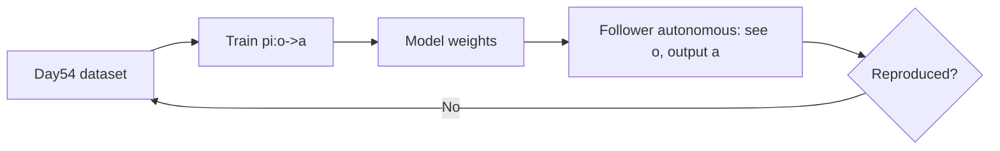

# BC Effect Demo and Local Training Pipeline

> **阶段**：P10 ｜ **今日课程**：201–203
> **日期**：2026-10-07 ｜ **Day 55 / 60**
> 本篇为《黑马程序员·具身智能》223 节配套复习笔记，零基础可读、不失专业；含流程图与易错点。

## 一、今日课程（集号映射）

- **201 BC effect demo**: see the trained BC make the follower autonomously reproduce the demo.
- **202 Data-collection notes**: data diversity / consistency points.
- **203 Local training flow**: get BC running on your own laptop first.

## 二、核心知识点（零基础讲透）

### 2.1 BC train → deploy loop
Train policy π(o→a) on Day54's data; after training, **without a human wearing the leader**, the follower sees images and outputs actions on its own, reproducing the task.

### 2.2 Data-collection notes (decide BC success)
- **Diversity**: demos must cover task variations (different starts, lighting), or it crashes on new cases.
- **Consistency**: do the same task stably; don't be fast then slow, or the network gets confused.
- **Enough volume**: run small-sample first, then scale up for generalization.

### 2.3 Local training flow
1. Load data (image+action); 2. Build a small net (e.g. CNN+RNN/MLP); 3. Supervised train (predict action vs expert action, MSE); 4. Save weights; 5. Deploy inference.

## 三、动手操作（跑通才算学会）

1. Run the BC training flow on your laptop (small sample first).
2. Load trained weights, let the follower autonomously reproduce yesterday's task, see the effect.
3. Check your dataset against "diversity/consistency" for gaps to fill.

## 四、易错点（前人踩过的坑）

- **Only one pose recorded → narrow distribution, crashes on new cases**: add diversity.
- **Training interrupted without background run → wasted**: even locally prefer nohup/background or frequent checkpoints.
- **Treating "runs" as "trained well"**: local small-sample success only validates the pipeline; real performance needs data volume and tuning.

## 五、DEA / 软体机器人交叉链接（轻量）

For DEA soft-gripper BC, action is a voltage sequence, loss is still MSE between predicted and expert voltage; consistency = same task, same voltage. Light cross-link.

## 六、今日小结 & 镜子复述 3 分钟

Today we turn BC from "data" into "a moving policy": train π locally so the follower autonomously reproduces the demo. Key: **data diversity/consistency decide success; run the pipeline locally first, then scale**.

> 说明：本系列为通用具身智能学习笔记（不是军事专题）。DEA（介电弹性体驱动器）仅作与本人研究方向的轻量交叉，不展开、不占主线。
