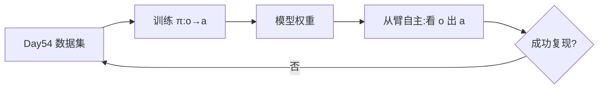

# 行为克隆效果展示与本地训练流程

> **阶段**：P10 ｜ **今日课程**：201–203
> **日期**：2026-10-07 ｜ **Day 55 / 60**
> 本篇为《黑马程序员·具身智能》223 节配套复习笔记，零基础可读、不失专业；含流程图与易错点。

## 一、今日课程（集号映射）

- **201 行为克隆效果展示**：看训练好的 BC 让从臂自主复现示教。
- **202 采集数据的注意事项**：数据多样性 / 一致性等要点。
- **203 本地电脑训练的流程**：在自己笔记本上先把 BC 跑通。

## 二、核心知识点（零基础讲透）

### 2.1 BC 训练 → 部署的闭环
用 Day54 录的数据训练策略 π(o→a)，训好后**不用人戴主臂**，从臂自己看画面出动作、复现任务。

### 2.2 数据采集的注意事项（决定 BC 成败）
- **多样性**：示范要覆盖任务的各种情况（不同起始位、不同光照），否则遇新情况崩。
- **一致性**：同一任务做法要稳定，别一会儿快一会儿慢，网络学混。
- **足量**：小样本先跑通，再逐步加量提泛化。

### 2.3 本地训练流程
1. 加载数据（图像+动作）；2. 搭一个小网络（如 CNN+RNN/MLP）；3. 监督训练（预测动作 vs 专家动作算 MSE）；4. 保存权重；5. 部署推理。

## 三、动手操作（跑通才算学会）

1. 在本地笔记本上跑通 BC 训练流程（小样本先通）。
2. 加载训好的权重，让从臂自主复现昨天录的任务，看效果。
3. 对照“多样性/一致性”检查自己的数据集哪里能补。

## 四、易错点（前人踩过的坑）

- **只录一种姿势 → 分布窄、遇新情况崩**：补多样性。
- **训练中断没用后台运行 → 白跑**：本地也建议 `nohup`/后台或随时存检查点。
- **把“跑通”当“训好”**：本地小样本通了只是验证流程，真效果靠数据量与调参。

## 五、DEA / 软体机器人交叉链接（轻量）

DEA 软体手 BC 训练时，动作是电压序列，损失仍是“预测电压 vs 专家电压”的 MSE；一致性指同任务同电压。轻量交叉。

## 六、今日小结 & 镜子复述 3 分钟

今天把 BC 从“数据”变成“会动的策略”：本地训练出 π，让从臂自主复现示教。关键提醒：**数据多样性/一致性决定成败，本地先跑通流程再上量**。

> 说明：本系列为通用具身智能学习笔记（不是军事专题）。DEA（介电弹性体驱动器）仅作与本人研究方向的轻量交叉，不展开、不占主线。
