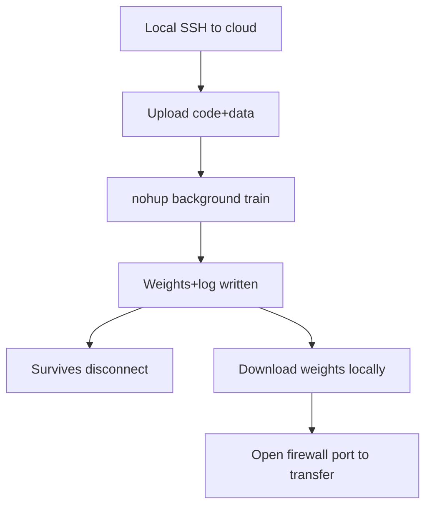

# Cloud Server Training nohup Background and Firewall Download

> **阶段**：P10 ｜ **今日课程**：204–207
> **日期**：2026-10-08 ｜ **Day 56 / 60**
> 本篇为《黑马程序员·具身智能》223 节配套复习笔记，零基础可读、不失专业；含流程图与易错点。

## 一、今日课程（集号映射）

- **204 Cloud-server training flow**: use cloud compute for bigger BC models.
- **205 Cloud nohup command**: run in background to survive disconnects.
- **206 Download trained model**: pull weights back locally.
- **207 Edit server firewall port**: open ports to transfer files / connect services.

## 二、核心知识点（零基础讲透）

### 2.1 Why the cloud
Local laptops have limited VRAM/compute; BC data is large and any slightly bigger network stalls. **Cloud servers** have GPUs, fit bigger models and long jobs.

### 2.2 nohup background (survive disconnect)
An SSH drop kills a foreground process. Use `nohup python train.py > log.txt 2>&1 &` to run training in the background — it survives disconnects.

### 2.3 Firewall ports
Cloud servers open only a few ports by default. **Before downloading models / starting services, open the port** (e.g. 22 SSH, custom file-transfer port), or you can't connect or pull back.

## 三、动手操作（跑通才算学会）

1. Upload code+data to the cloud, start BC training with `nohup` in background.
2. During training, `tail -f log.txt` to watch progress.
3. After training, open the firewall port, `scp`/download weights back locally.

## 四、易错点（前人踩过的坑）

- **Firewall port closed → can't connect / pull back**: open the port before transferring.
- **No nohup → one disconnect wastes everything**: long jobs must run in background.
- **Wrong download path → model lost**: `pwd` to confirm dir before download; date-stamp filenames to avoid overwrite.

## 五、DEA / 软体机器人交叉链接（轻量）

DEA HV-driving policies can also train on the cloud (large data); same nohup background, open port to pull back voltage-policy weights. Light cross-link.

## 六、今日小结 & 镜子复述 3 分钟

Today we solve BC's "compute and persistence": cloud GPU for big models, nohup background against disconnects, open firewall port to pull weights back. P10 (Behavior Cloning) closes here — you've walked the full "collect → train → deploy" chain.

> 说明：本系列为通用具身智能学习笔记（不是军事专题）。DEA（介电弹性体驱动器）仅作与本人研究方向的轻量交叉，不展开、不占主线。
