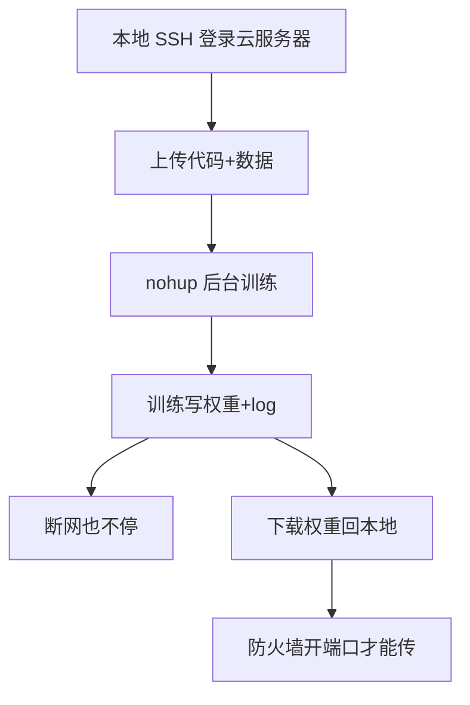

# 云服务器训练与 nohup 后台及防火墙下载

> **阶段**：P10 ｜ **今日课程**：204–207
> **日期**：2026-10-08 ｜ **Day 56 / 60**
> 本篇为《黑马程序员·具身智能》223 节配套复习笔记，零基础可读、不失专业；含流程图与易错点。

## 一、今日课程（集号映射）

- **204 云服务器训练的流程**：用云上算力训更大的 BC 模型。
- **205 云服务器的 nohup 指令**：后台运行防断网中断。
- **206 下载服务器上训练好的模型**：把权重取回本地。
- **207 修改服务器的防火墙端口号**：开端口才能传文件/连服务。

## 二、核心知识点（零基础讲透）

### 2.1 为什么上云
本地笔记本显存/算力有限，BC 数据量大、网络稍大就跑不动。**云服务器**有 GPU，适合训大模型、跑长时间任务。

### 2.2 nohup 后台运行（防断网）
SSH 一断，前台进程就死。用 `nohup python train.py > log.txt 2>&1 &` 让训练在后台跑，断网也不停。

### 2.3 防火墙端口
云服务器默认只开少数端口。**下载模型/起服务前要开对应端口**（如 22 SSH、自定义端口传文件），否则连不上、传不回。

## 三、动手操作（跑通才算学会）

1. 把代码和数据传到云服务器，用 `nohup` 后台启动 BC 训练。
2. 训练中用 `tail -f log.txt` 看进度。
3. 训练完开防火墙端口，把权重 `scp`/下载回本地。

## 四、易错点（前人踩过的坑）

- **云服务器防火墙端口没开 → 连不上/传不回**：先开端口再传。
- **没用 nohup → 一断网全白跑**：长任务必须后台。
- **下载路径错 → 模型丢失**：下载前 `pwd` 确认目录，文件名带日期防覆盖。

## 五、DEA / 软体机器人交叉链接（轻量）

DEA 高压驱动策略也可用云服务器训（数据大）；同样 nohup 后台、开端口取回电压策略权重。轻量交叉。

## 六、今日小结 & 镜子复述 3 分钟

今天解决 BC 的“算力与持久化”：用云服务器 GPU 训大模型，`nohup` 后台防断网，开防火墙端口把权重取回。P10（行为克隆）到此收口——你已经走完“采集→训练→部署”全链。

> 说明：本系列为通用具身智能学习笔记（不是军事专题）。DEA（介电弹性体驱动器）仅作与本人研究方向的轻量交叉，不展开、不占主线。
