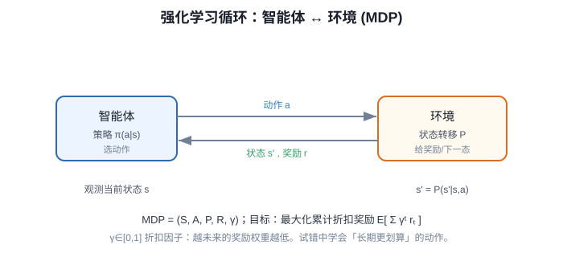

# 强化学习五大概念与 MDP 马尔可夫决策过程

> **阶段**：P11 ｜ **今日课程**：208–210
> **日期**：2026-10-09 ｜ **Day 57 / 60**
> 本篇为《黑马程序员·具身智能》223 节配套复习笔记，零基础可读、不失专业；含流程图与易错点。

## 一、今日课程（集号映射）

- **208 强化学习的 5 大概念**：Agent / Environment / State / Action / Reward。
- **209 强化学习的概念分析**：把五大概念套到具身机器人上理解。
- **210 MDP 状态转移模型**：马尔可夫决策过程，状态如何一步转移。

## 二、核心知识点（零基础讲透）

### 2.1 强化学习五大概念（先背熟）
| 概念 | 含义 | 具身机器人例子 |
|------|------|----------------|
| Agent | 做决策的“智能体” | 控制器 / 策略网络 |
| Environment | Agent 之外的世界 | 真实车间、桌面、物体 |
| State (s) | 当前局面 | 关节角 + 相机画面 |
| Action (a) | Agent 出的招 | 发给舵机的力矩/角度 |
| Reward (r) | 环境给的打分 | 抓到物体 +1，掉地 -1 |

### 2.2 RL 的循环
Agent 看 State → 出 Action → 环境变新 State 并给 Reward → Agent 学“怎么出 Action 能让累计 Reward 最大”。

### 2.3 MDP（马尔可夫决策过程）
MDP 是说：**下一步状态只取决于“当前状态 + 当前动作”，和过去无关**（“无记忆性”/马尔可夫性）。
- 数学表达：s' ~ P(s'|s,a)，转移概率只依赖 (s,a)。
- 意义：只要把“当前状态”描述够全，历史就不用管，问题可解。

## 2.5 补充细节：RL 五大概念与 MDP

- 五大概念：状态 s（智能体看到的世界）、动作 a（能做的选择）、奖励 r（环境给的分数）、策略 π(a|s)（在什么状态下选什么动作）、价值 V(s) 或 Q(s,a)（某个状态/动作有多值钱）。
- MDP 形式化：五元组 (S, A, P, R, γ)；P 是状态转移概率，R 是奖励，γ∈[0,1] 折扣因子。
- 目标：最大化「累计折扣奖励」的期望 E[Σ γᵗ rᵗ]——越未来的奖励权重越低。
- 两类主流方法：值函数方法（学 Q/V 再派生策略）和策略梯度方法（直接优化 π）；BC 是模仿，RL 是试错优化。

## 3. 一张图

## 三、动手操作（跑通才算学会）

1. 用一两句话给“具身机器人”定义五大概念（如 Agent=控制器，State=关节角+相机画面，Action=发给舵机的力矩，Reward=成功抓到 +1）。
2. 画 RL 循环图（Agent↔Environment）。
3. 口述：为什么 MDP 假设“下一步只看当前”能简化问题？

## 四、易错点（前人踩过的坑）

- **把 RL 的“奖励”和“监督学习的标签”搞混**：RL 没有现成正确答案，只有环境给的奖励信号（可能延迟、稀疏）。
- **Reward 设计成“每一步都给”**：过度密集奖励会诱导走捷径，要设计能反映真实目标的奖励。
- **State 描述不全 → 不满足马尔可夫性**：漏掉关键信息（如物体速度）会让策略学不会。

## 五、DEA / 软体机器人交叉链接（轻量）

DEA 软体臂做 RL 时：State 含“形变/电压”，Action 是驱动电压，Reward 如“软手闭合包住物体+1”。轻量交叉，主线是通用 RL 概念。

## 六、今日小结 & 镜子复述 3 分钟

今天进入 P11（强化学习）。先背熟五大概念 Agent/Environment/State/Action/Reward，再理解 RL 循环与 MDP 的“无记忆性”。核心提醒：**RL 没有标签只有奖励，这是和 BC 最本质的区别**。

> 说明：本系列为通用具身智能学习笔记（不是军事专题）。DEA（介电弹性体驱动器）仅作与本人研究方向的轻量交叉，不展开、不占主线。
