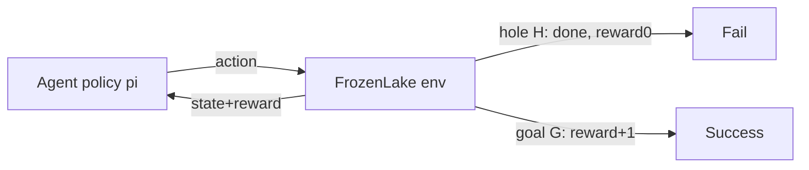

# MDP RL Relation and Gym Environment Getting Started

> **阶段**：P11 ｜ **今日课程**：211–214
> **日期**：2026-10-10 ｜ **Day 58 / 60**
> 本篇为《黑马程序员·具身智能》223 节配套复习笔记，零基础可读、不失专业；含流程图与易错点。

## 一、今日课程（集号映射）

- **211 MDP and RL relation**: RL is finding the "optimal policy" on an MDP.
- **212 Install RL environment gym**: install Gym/Gymnasium.
- **213 FrozenLake environment demo**: the classic RL starter.
- **214 FrozenLake random-move demo**: see the difference between "wandering" and "learned walking".

## 二、核心知识点（零基础讲透）

### 2.1 RL is finding the optimal policy on an MDP
- **Policy π**: given state s, decide action a (π(a|s)).
- RL's goal: find π* that maximizes expected cumulative reward.
- Because the world is an MDP (next step only sees current), "decide from current state only" suffices — no full history needed.

### 2.2 What Gym / Gymnasium is
RL's "training ground": it provides standard environments (state, action, reward, reset) so you focus on writing the Agent.
- Old package `gym`, new maintained `gymnasium` (slightly different API).

### 2.3 FrozenLake starter
A 4×4 grid: walk from top-left to the bottom-right goal; step on a hole (H) → fall, zero; reach goal (G) → +1.
- **Random policy**: pick direction randomly → often falls in holes.
- **After learning**: policy learns to avoid H, take safe path → reach G steadily.

## 三、动手操作（跑通才算学会）

1. Install `gymnasium` (`pip install gymnasium`).
2. Run FrozenLake with a random policy, observe "wandering often falls in holes".
3. Compare: change the random policy to a dumb rule "always right/down", see success-rate change.

## 四、易错点（前人踩过的坑）

- **Old/new Gym API differ** (`gym` vs `gymnasium`, `step` return changed): check docs for your installed version, don't mix.
- **Wrong `reset`/`step` return format → loop crashes**: new gymnasium returns 5-tuple `obs, reward, terminated, truncated, info`.
- **Skipping FrozenLake as "too simple"**: it's the minimal lab for "policy/reward/episode"; later DQN is often validated on it too.

## 五、DEA / 软体机器人交叉链接（轻量）

DEA soft-arm control can also train RL in a Gym-style sim (custom soft-contact env); start with FrozenLake to grasp episodes and reward. Light cross-link.

## 六、今日小结 & 镜子复述 3 分钟

Today we connect "MDP" and "RL": RL finds the optimal policy π* on an MDP; we run the first RL env with Gymnasium + FrozenLake. Mind the old/new Gym API difference; don't trip on reset/step formats.

> 说明：本系列为通用具身智能学习笔记（不是军事专题）。DEA（介电弹性体驱动器）仅作与本人研究方向的轻量交叉，不展开、不占主线。
