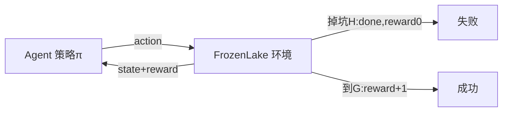

# MDP 与强化学习关系及 Gym 环境上手

> **阶段**：P11 ｜ **今日课程**：211–214
> **日期**：2026-10-10 ｜ **Day 58 / 60**
> 本篇为《黑马程序员·具身智能》223 节配套复习笔记，零基础可读、不失专业；含流程图与易错点。

## 一、今日课程（集号映射）

- **211 MDP 和强化学习的关系**：RL 就是在 MDP 上找“最优策略”。
- **212 强化学习环境 gym 的安装**：装 Gym/Gymnasium。
- **213 强化学习冰冻湖环境演示**：FrozenLake 经典入门。
- **214 冰冻湖随机移动的效果展示**：看“乱走”和“学过后走”的区别。

## 二、核心知识点（零基础讲透）

### 2.1 RL 就是在 MDP 上找最优策略
- **策略 π**：看到状态 s，决定出什么动作 a（π(a|s)）。
- RL 的目标：找到让“累计奖励期望”最大的 π*。
- 因为世界是 MDP（下一步只看当前），所以“只看当前状态做决策”就够了，不用记全程历史。

### 2.2 Gym / Gymnasium 是什么
RL 的“练习场”：它提供标准环境（状态、动作、奖励、重置），让你专注写 Agent。
- 老包叫 `gym`，新维护版叫 `gymnasium`（API 略有不同）。

### 2.3 FrozenLake（冰冻湖）入门
4×4 网格，从左上角走到右下角终点，踩到冰窟窿（H）就掉下去归零，踩到目的地（G）得 +1。
- **随机策略**：每步随机选方向 → 经常掉坑。
- **学过后**：策略学会绕开 H、走安全路 → 稳定到 G。

## 三、动手操作（跑通才算学会）

1. 安装 `gymnasium`（`pip install gymnasium`）。
2. 写随机策略跑 FrozenLake，观察“乱走经常掉坑”。
3. 对比：把随机策略改成“永远向右/下”的笨规则，看成功率变化。

## 四、易错点（前人踩过的坑）

- **Gym 新老版本 API 不同**（`gym` vs `gymnasium`，`step` 返回变了）：按你装的版本查文档，别混用。
- **`reset`/`step` 返回格式弄错 → 循环写崩**：新 gymnasium 返回 `obs, reward, terminated, truncated, info` 五元组。
- **以为 FrozenLake 简单就跳过**：它是理解“策略/奖励/回合”的最小实验台，后面 DQN 也常在它上验证。

## 五、DEA / 软体机器人交叉链接（轻量）

DEA 软体臂控制也可在 Gym 式仿真里练 RL（自定义软体接触环境）；先 FrozenLake 理解回合与奖励即可。轻量交叉。

## 六、今日小结 & 镜子复述 3 分钟

今天把“MDP”和“RL”接起来：RL 就是在 MDP 上找最优策略 π*；并用 Gymnasium + FrozenLake 跑通第一个 RL 环境。注意新老 Gym API 差异，别在 reset/step 格式上栽跟头。

> 说明：本系列为通用具身智能学习笔记（不是军事专题）。DEA（介电弹性体驱动器）仅作与本人研究方向的轻量交叉，不展开、不占主线。
