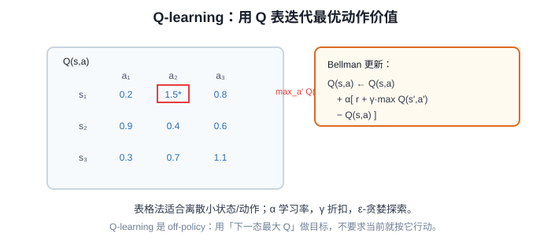

# Q-learning 表格法原理与代码实现

> **阶段**：P11 ｜ **今日课程**：215–218
> **日期**：2026-10-11 ｜ **Day 59 / 60**
> 本篇为《黑马程序员·具身智能》223 节配套复习笔记，零基础可读、不失专业；含流程图与易错点。

## 一、今日课程（集号映射）

- **215 初始化强化学习的 q 表**：建一张“状态×动作”的表。
- **216 q 表数据更新的原理**：Q 值怎么更新。
- **217 Q 表奖励的传递更新**：奖励沿路径反传。
- **218 qlearning 强化学习的最终代码**：写出可跑的 Q-learning。

## 二、核心知识点（零基础讲透）

### 2.1 Q 表是什么
当状态/动作是**离散且不多**时，用一张表存“在某状态出某动作有多好”：
- 行 = 状态 s，列 = 动作 a，格子 = Q(s,a) = 期望累计奖励。
- 学完看表：每个状态选 Q 最大的动作即可（贪婪策略）。

### 2.2 更新公式（核心）
每次走一步，用“刚得到的奖励”修正对 Q 的估计：

```
Q(s,a) ← Q(s,a) + α [ r + γ·max_a' Q(s',a') − Q(s,a) ]
```
- α（学习率）：步子多大；γ（折扣）：多看重未来奖励。
- `r + γ·max Q(s',a')` 叫“TD 目标”，减号左边是旧估计、右边是新目标，差值是“误差”。

### 2.3 奖励沿路径反传
因为每一步都用到“下一步的 max Q”，**终点的奖励会一步步往前传**，远处的状态也逐渐知道“走这条路最终有奖”。

## 2.5 补充细节：Q-learning 表格法

- 表格法：把 Q(s,a) 存成一张查表，适合离散、规模不大的状态/动作空间。
- 更新规则（Bellman）：`Q(s,a) ← Q(s,a) + α[ r + γ·max_a' Q(s',a') − Q(s,a) ]`。
- 含义：用「下一态能拿到的最大 Q」当目标，把当前估计往目标拉；α 是学习率，γ 是折扣。
- off-policy（离策略）：目标用的是「下一态最大 Q」对应的贪心动作，不要求当前步真按它走。
- 探索：ε-贪婪——以 ε 概率随机选动作去探索，1−ε 概率贪心选 max Q。

## 3. 一张图



## 三、动手操作（跑通才算学会）

1. 初始化 FrozenLake 的 Q 表（状态数 × 动作数，全 0）。
2. 写 Q-learning 训练循环（ε-贪婪探索 + 上述更新公式）。
3. 训练前后打印 Q 表，看目标格附近 Q 值是否变高、路径是否变优。

## 四、易错点（前人踩过的坑）

- **γ（折扣）设 0 → 只贪眼前**：终点奖励传不到远处，远状态学不会。一般取 0.9~0.99。
- **ε-贪婪探索率太低 → 从不试新动作、卡局部最优**：前期要大 ε 多探索，后期再减小利用。
- **状态数爆炸还用表格**：状态连续/太多时 Q 表装不下 → 这正是 Day60 DQN（用神经网络代替表）的动机。

## 五、DEA / 软体机器人交叉链接（轻量）

DEA 软体位姿离散化后也能先用 Q 表试 RL；但形变连续，最终要上 DQN/策略梯度。轻量交叉，主线是表格法 Q-learning。

## 六、今日小结 & 镜子复述 3 分钟

今天写出第一个能跑的 RL 算法——Q-learning 表格法：用 Q(s,a) 表存“状态-动作价值”，按 TD 公式更新，奖励沿路径反传。记住两个旋钮：γ 管未来、ε 管探索；状态太多就交给明天的 DQN。

> 说明：本系列为通用具身智能学习笔记（不是军事专题）。DEA（介电弹性体驱动器）仅作与本人研究方向的轻量交叉，不展开、不占主线。
