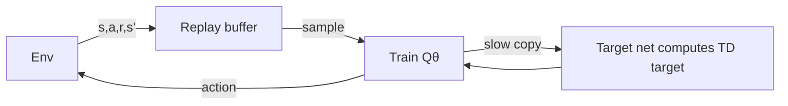
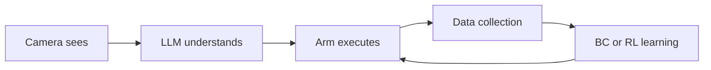

# DQN Deep RL HuggingFace and Genetic NN Graduation

> **阶段**：P11 ｜ **今日课程**：219–223
> **日期**：2026-10-12 ｜ **Day 60 / 60**
> 本篇为《黑马程序员·具身智能》223 节配套复习笔记，零基础可读、不失专业；含流程图与易错点。

## 一、今日课程（集号映射）

- **219 DQN intro**: use a neural network instead of the Q-table.
- **220 Visualize Q-table training**: plot the Q-table training process.
- **221 HuggingFace model site intro**: model/dataset community.
- **222 HuggingFace text-to-image**: try HF's text-to-image.
- **223 Genetic neural network intro**: evolutionary algo raises a batch, keeps good, drops bad.

## 二、核心知识点（零基础讲透）

### 2.1 DQN = neural net replaces Q-table
The Q-table only fits "few, discrete states". With many/continuous states (e.g. pixel images), **DQN uses a neural net Qθ(s,a) to estimate value directly**, parameters θ replace the whole table.

Key techniques:
- **Experience Replay**: store traversed (s,a,r,s') and sample randomly to learn, breaking correlation and stabilizing training.
- **Target Network**: a "slow-updated" copy computes the TD target, avoiding "chasing itself" oscillation.

### 2.2 HuggingFace (HF)
The world's largest **model + dataset + space** community: download pretrained models (vision/language/RL), upload your own, build demos instantly with Spaces. Indispensable for embodied AI.

### 2.3 Genetic neural network (evolution)
No gradients, no reward backprop — instead **raise a "population" of neural nets**: each individual runs the task for "fitness", keep good/drop bad, cross-over and mutate, evolve better policies generation by generation. Fits non-differentiable / sparse-reward cases.

### 2.4 Capstone: BC vs RL total comparison
| Dimension | BC (Behavior Cloning) | RL (Reinforcement Learning) |
|-----------|----------------------|------------------------------|
| Sample efficiency | High (direct imitation) | Low (trial-and-error) |
| Needs reward? | No (needs expert labels) | Yes |
| Can exceed expert? | Hard | Possible |
| Stability | High (supervised) | Low (jittery/collapse) |
| Fits tasks | demos easy, continuous action | reward designable, needs exploration |

### 2.5 60-day panorama (graduation check)
Finishing 60 days ≠ truly knowing. The test is whether you can independently explain and run this chain once:

## 三、动手操作（跑通才算学会）

1. Run Stable-Baselines3's DQN on CartPole, see if reward rises.
2. Open HuggingFace, find an embodied/vision model, try download and text-to-image.
3. Draw a BC vs RL comparison table, speak 3 minutes into a mirror on the "60-day panorama" (camera → understand → execute → collect → learn).

## 四、易错点（前人踩过的坑）

- **DQN only updates seen states → needs enough exploration**: don't turn off ε-greedy too early, or it outputs garbage on new frames.
- **Genetic algo population too small → premature convergence**: give enough population and generations; a bad fitness function yields "cheating" solutions.
- **Treating HF as "only text-to-image"**: HF is also a treasure trove of RL/embodied models; downloading pretrained weights saves huge compute.
- **Graduation = the end**: 60 days is the start of the loop; running the chain once is the real "graduation".

## 五、DEA / 软体机器人交叉链接（轻量）

DEA soft actuators can use DQN (state = continuous deformation/voltage, exactly why a net replaces the table) or genetic search for a "safe voltage envelope"; HF also hosts soft/tactile models to borrow. Light cross-link; main line is generic DQN/genetic NN and graduation.

## 六、今日小结 & 镜子复述 3 分钟

60-day capstone! Today: DQN (neural net replaces Q-table, experience replay + target net), HuggingFace (model community), genetic neural network (evolutionary trial-and-error). Finally draw a BC vs RL total comparison and explain the chain "camera → LLM → arm → data → BC/RL" in the mirror — running it independently is the real graduation.

> 说明：本系列为通用具身智能学习笔记（不是军事专题）。DEA（介电弹性体驱动器）仅作与本人研究方向的轻量交叉，不展开、不占主线。
