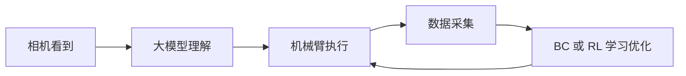
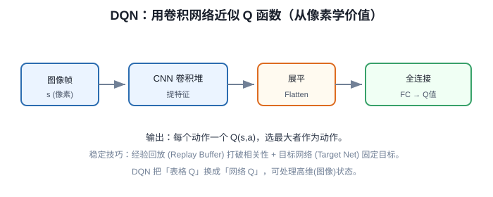

# DQN 深度强化学习与 HuggingFace 及遗传神经网络结营

> **阶段**：P11 ｜ **今日课程**：219–223
> **日期**：2026-10-12 ｜ **Day 60 / 60**
> 本篇为《黑马程序员·具身智能》223 节配套复习笔记，零基础可读、不失专业；含流程图与易错点。

## 一、今日课程（集号映射）

- **219 DQN 强化学习简介**：用神经网络代替 Q 表。
- **220 Qtable 的可视化训练过程**：把 Q 表训练过程画出来看。
- **221 HuggingFace 模型网站介绍**：模型/数据集社区。
- **222 HuggingFace 文生图**：体验 HF 上的文生图能力。
- **223 遗传神经网络的介绍**：进化算法养一批试错、留优去劣。

## 二、核心知识点（零基础讲透）

### 2.1 DQN = 用神经网络代替 Q 表
Q 表只适合“状态少且离散”。状态多/连续时（如像素画面），**DQN 用一个神经网络 Qθ(s,a) 直接估计价值**，参数 θ 代替整张表。

关键技术：
- **经验回放（Replay Buffer）**：把走过的 (s,a,r,s') 存起来随机采样再学，打破相关性、稳训练。
- **目标网络（Target Net）**：用一份“慢更新”的副本算 TD 目标，避免“自己追自己”震荡。

### 2.2 HuggingFace（HF）
全球最大的**模型 + 数据集 + 空间**社区：下载预训练模型（视觉/语言/RL）、上传自己的成果、用 Space 秒搭演示。做具身智能离不开它。

### 2.3 遗传神经网络（进化算法）
不发梯度、不靠奖励反传，而是**养一批神经网络“种群”**：每个个体跑任务得“适应度”，留优去劣、交叉变异，一代代进化出好策略。适合不可导/奖励稀疏的场景。

### 2.4 收官：BC vs RL 总对比表
| 维度 | BC（行为克隆） | RL（强化学习） |
|------|---------------|----------------|
| 样本效率 | 高（直接模仿） | 低（自己试错） |
| 是否需奖励 | 否（要专家标签） | 是 |
| 能否超过专家 | 难 | 可能 |
| 稳定性 | 高（监督） | 低（易抖/塌） |
| 适合任务 | 示范易得、动作连续 | 奖励好设计、需探索 |

### 2.5 60 天全景（结营检查）
60 天走完 ≠ 真会。关键看你能不能独立把这条链讲清楚、跑通一遍：

## 2.6 补充细节：DQN 用网络近似 Q

- DQN = 用 CNN 当函数近似器，直接把图像像素 s 映射成每个动作的 Q 值，省去手工特征。
- 两个关键稳定技巧：① 经验回放(Replay Buffer)——把转移 (s,a,r,s') 存池子随机采样，打破样本时间相关性；② 目标网络(Target Net)——用一份慢更新的网络算目标 Q，避免「自己追自己」振荡。
- 损失：TD 误差均方 `(r + γ·max_a' Q_target(s',a') − Q(s,a))²`。
- 和 Q-learning 的关系：表格换成网络，从「离散小问题」走到「高维图像问题」。

## 3. 一张图

## 三、动手操作（跑通才算学会）

1. 用 Stable-Baselines3 的 DQN 在 CartPole 上跑一版，看 reward 是否上升。
2. 打开 HuggingFace，找一个具身/视觉模型体验下载与文生图。
3. 画一张 BC vs RL 对比表，对着镜子讲 3 分钟“60 天全景”（相机→理解→执行→采集→学习优化）。

## 四、易错点（前人踩过的坑）

- **DQN 只见过的状态才更新 → 需足够探索**：ε-贪婪别过早关，否则遇到新画面乱出。
- **遗传算法种群太小 → 早熟收敛**：种群和代数要给够，适应度函数设计差会出“作弊”解。
- **把 HF 当“只会文生图”**：HF 更是 RL/具身模型的宝库，下载预训练权重能省大量算力。
- **结营 = 结束**：60 天是闭环起点，链跑通一遍才算“毕业”。

## 五、DEA / 软体机器人交叉链接（轻量）

DEA 软体执行器控制可上 DQN（状态=形变/电压连续，正好用网络代替 Q 表）或遗传策略搜“安全电压包络”；HF 上也有软体/触觉相关模型可借鉴。轻量交叉，主线是通用 DQN/遗传 NN 与结营。

## 六、今日小结 & 镜子复述 3 分钟

60 天收官！今天学 DQN（神经网络代替 Q 表，经验回放+目标网络）、HuggingFace（模型社区）、遗传神经网络（进化试错）。最后画一张 BC vs RL 总对比表，对着镜子讲清“相机看到→大模型理解→机械臂执行→数据采集→BC/RL 学习优化”这条链——能独立跑通一遍，才算真毕业。

> 说明：本系列为通用具身智能学习笔记（不是军事专题）。DEA（介电弹性体驱动器）仅作与本人研究方向的轻量交叉，不展开、不占主线。
