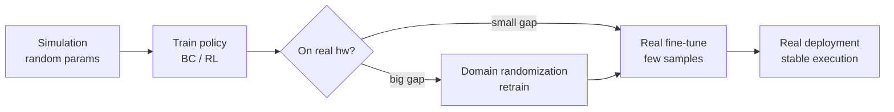

# Sim-to-Real Transfer and Domain Randomization

> **Phase**: Extension (self-study) ｜ **Builds on**: Day 51–56 BC / Day 57–60 RL
> **Date**: 2026-10-13 (Tuesday) ｜ **Day 61 / 63**
> This is an extension chapter beyond the 黑马程序员 *Embodied Intelligence* 223-lecture course (the course ends at episode 223; this chapter continues the BC/RL engineering story). Readable from zero base; includes a flow diagram and pitfalls.

## 1. Today's Content (why a standalone chapter)

The course “graduated” on Day 60 with DQN + genetic NN, but one **engineering must-pass question** was never spelled out: **how do we take a policy (BC or RL) trained in simulation and make it work on real hardware?**

The answer is Sim-to-Real. I split it into three parts: ① where the sim-vs-real gap comes from; ② how domain randomization shrinks it; ③ why my soft actuator (DEA) makes it harder.

## 2. Core Concepts (Zero-Base Deep Dive)

### 2.1 What is the Sim-to-Real gap
A simulator is an “ideal world”: friction, gravity, latency, sensor noise are all values you set; real hardware is a “messy world”: belts slip, cables are soft, the camera lags, lighting changes randomly.
- A model can hit 99% in simulation and drop to 0% on real hardware — that is the **Sim-to-Real gap**.
- Essence: training distribution (sim) ≠ test distribution (real) → generalization fails. This is the same family of problem as the BC distribution shift we met on Day 10-03.

### 2.2 Domain Randomization: “deliberately create chaos” in simulation
Since real hardware is messy, **randomize the environment parameters during training** so the policy has seen enough variety of “mess” that the real hardware's “one kind of mess” is survivable:
- Randomize: friction, mass, camera pose, lighting, noise, latency…
- Intuition: train not in “one clean sim” but in “a thousand slightly different sims” → the learned policy is insensitive to parameters.
- Advanced: instead of covering everything randomly, first estimate the real hardware's true parameter distribution (system identification) then randomize — called Dynamics Randomization.

### 2.3 Other bridge techniques (light)
- **System identification**: measure the real hardware's true physical parameters first, then “calibrate” the sim to look more like reality.
- **Real-data fine-tuning**: sim pre-train + a little real data fine-tune is more stable than pure sim.
- **Causal / invariant features**: make the policy learn features robust to disturbance instead of memorizing sim pixels.

### 2.4 Why my DEA soft actuator is harder (light cross-link)
Rigid arms already struggle with Sim-to-Real; **soft bodies / DEA are harder** because:
- Deformation is **continuous, hysteretic, non-linear** (voltage→deformation is not a straight line and depends on history) — hard to model precisely in sim → the sim-real gap is naturally larger.
- Direction: use a **data-driven forward model** (a neural net approximating DEA's hysteresis curve) as part of the simulator, then apply domain randomization; this is exactly the cross-over point I want to explore next.

## 2.5 Extra Detail: connecting Sim-to-Real to earlier knowledge

- BC's Sim-to-Real: if demos are collected in sim, real deployment hits the gap; domain randomization + a little real fine-tuning is the common fix.
- RL's Sim-to-Real: RL is especially suited to sim training (lots of trial-and-error without breaking hardware); train DQN/policy-gradient then transfer; but real reward is hard to give and brittle, so design the reward solidly in sim first.
- One line: train policy in sim → domain randomization makes it “robust” → a little real data fine-tunes it → deploy.

## 3. One Diagram (Mermaid)

## 4. Hands-On (Run It to Learn It)

1. Run a BC policy in LeRobot / simulation; record the gap between “sim success rate” and “first real-hardware success rate” — that gap is what you must fill.
2. Add one randomization (e.g. random friction), retrain, see if real success recovers.
3. Write one sentence: why is “train in sim, deploy on real” cheaper than “train directly on real”? (hint: real trial-and-error is expensive and breaks hardware.)

## 5. Pitfalls (Lessons from Others)

- **Assuming sim-trained = real-usable**: wrong — the gap can swallow all performance; always test on real hardware before shipping.
- **Randomizing blindly**: too-wide range → policy learns nothing useful; too-narrow → still overfits sim. Base it on measured real-parameter distributions.
- **Ignoring sensor latency**: sim gives instant feedback; real hardware lags → the gap is especially large under high-frequency control.

## 6. DEA / Soft-Robot Cross-Link (Light)

The key to DEA soft-body Sim-to-Real is the “forward model”: first fit the voltage→deformation hysteresis with data, then embed that model into the simulator for domain randomization. This is a natural entry point for my research direction.

## 7. Daily Summary & 3-Min Mirror Recap

Today we filled the engineering must-pass question the course didn't spell out: **Sim-to-Real gap + domain randomization**. Core line: train the policy in sim, make it robust by “deliberately creating chaos in sim (domain randomization)”, then fine-tune with a little real data, so it deploys stably. Soft actuators have a larger gap because deformation is hard to model — that's my cross-research entry point.

> Note: This series is general embodied-AI study notes (not a military topic). DEA (Dielectric Elastomer Actuator) appears only as a light cross-link to the author's own research direction — not expanded, not on the main line.