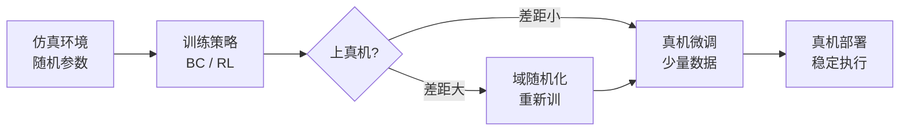

# 仿真到真机迁移（Sim-to-Real）与域随机化

> **阶段**：扩展章节（自学延伸）｜ **承接**：Day 51–56 BC / Day 57–60 RL
> **日期**：2026-10-13（周二）｜ **Day 61 / 63**
> 本篇为《黑马程序员·具身智能》223 节的延伸自学章节（课程 223 节已完结，此处承接前面的 BC/RL 知识做工程落地）。零基础可读、不失专业；含流程图与易错点。

## 一、今日内容（为什么单独讲这一章）

课程在 Day 60 用 DQN + 遗传神经网络“结营”，但有一个**工程上的必考题**没单独展开：**我们在仿真里训好的策略（BC 或 RL），怎么搬到真机上还能用？**

答案就是 Sim-to-Real（仿真到真机迁移）。这一章我把它拆成三件事：① 仿真和真机的差距从哪来；② 域随机化怎么缩差距；③ 我的软体执行器（DEA）为什么更难。

## 二、核心知识点（零基础讲透）

### 2.1 什么是 Sim-to-Real 鸿沟
仿真器是个“理想世界”：摩擦系数、重力、时延、传感器噪声都是你设的；真机是个“messy 世界”：皮带打滑、线材软、相机延迟、光照乱变。
- 模型在仿真里 99% 成功率，上真机可能直接 0% —— 这就是 **Sim-to-Real gap（仿真-真机鸿沟）**。
- 本质：训练分布（仿真）和测试分布（真机）不一致 → 泛化失败，和 Day 10-03 说的 BC 分布偏移（distribution shift）是同一个家族的问题。

### 2.2 域随机化（Domain Randomization）：在仿真里“故意制造混乱”
既然真机乱，那就在仿真里**把环境参数随机打乱**训练，让策略见过足够多样的“乱”，到真机这种“某一种乱”反而能扛：
- 随机量：摩擦系数、质量、相机位姿、光照、噪声、时延……
- 直觉：不是在“一个干净仿真”里训，而是在“一千个略不同的仿真”里训 → 学到的策略对参数不敏感。
- 进阶：不求随机覆盖一切，而是**先估真机的真实参数分布（系统辨识）再随机**，叫 Dynamics Randomization。

### 2.3 其他补桥手段（轻量了解）
- **系统辨识**：先量真机的真实物理参数，把仿真“校准”得更像真机。
- **真实数据微调（fine-tune）**：仿真预训练 + 少量真机数据微调，比纯仿真稳。
- **因果/不变特征**：让策略学“对干扰不敏感”的特征，而不是死记仿真画面。

### 2.4 我的 DEA 软体执行器为什么更难（轻量交叉）
刚性臂的 Sim-to-Real 已经难；**软体 / DEA 更难**，因为：
- 形变是**连续、迟滞、非线性**的（电压→形变不是一条直线，还看历史），仿真里很难精确建模 → 仿真和真机差距天然更大。
- 对策方向：用**数据驱动的正向模型**（神经网络近似 DEA 的迟滞曲线）当仿真器的一部分，再上域随机化；这正是我后续想做的交叉点。

## 2.5 补充细节：Sim-to-Real 与前面知识的连接

- BC 的 Sim-to-Real：示教若在仿真采，真机部署就面临 gap；域随机化 + 真机少量微调是常用解。
- RL 的 Sim-to-Real：RL 特别适合在仿真里训（能大量试错不坏硬件），DQN/策略梯度训好再迁移；但真机奖励难给、易碎，迁移前要在仿真把 reward 设计扎实。
- 一句话串：仿真训策略 → 域随机化让策略“皮实” → 真机少量数据微调 → 上线。

## 3. 一张图（Mermaid）

## 三、动手操作（跑通才算学会）

1. 在 LeRobot / 仿真里跑一个 BC 策略，记录“仿真成功率”和“真机第一次成功率”的落差——这就是你要填的 gap。
2. 给仿真加一项随机（比如随机摩擦），重训，看真机成功率是否回升。
3. 写一句话：为什么“在仿真里训、上真机用”比“直接在真机训”更划算？（提示：真机试错贵且易坏。）

## 四、易错点（前人踩过的坑）

- **以为仿真训好 = 真机能用**：错，gap 能吞掉全部性能；上线前必测真机。
- **域随机化乱随机**：随机范围太离谱 → 策略学不到有用东西；太窄 → 仍过拟合仿真。要基于真机实测参数分布。
- **忽视传感器时延**：仿真是“瞬间反馈”，真机有延迟 → 高频控制下差距尤其大。

## 五、DEA / 软体机器人交叉链接（轻量）

DEA 软体的 Sim-to-Real 关键在“正向模型”：先用数据拟合 电压→形变 的迟滞关系，再把这个模型嵌进仿真器做域随机化。这块是我研究方向的天然切口。

## 六、今日小结 & 镜子复述 3 分钟

今天补上了课程没单独讲的工程必考题：**Sim-to-Real 鸿沟 + 域随机化**。核心一句：仿真里训策略，靠“在仿真里故意制造混乱（域随机化）”让策略皮实，再用真机少量数据微调，才能稳稳上线。软体执行器因为形变难建模，gap 更大，是我的交叉研究切入点。

> 说明：本系列为通用具身智能学习笔记（不是军事专题）。DEA（介电弹性体驱动器）仅作与本人研究方向的轻量交叉，不展开、不占主线。