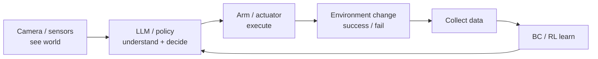

# End-to-End Deployment Review and Integrated Project Design

> **Phase**: Extension (self-study) ｜ **Builds on**: Day 1–60 full pipeline
> **Date**: 2026-10-14 (Wednesday) ｜ **Day 62 / 63**
> This is an extension chapter beyond the 223-lecture course. We review the whole “camera sees → LLM understands → arm executes → data collected → BC/RL improves” pipeline, and design one deployable integrated mini-project. Readable from zero base; includes a diagram.

## 1. Today's Content (why review + build a project)

On Day 60 we said: “finishing 60 days ≠ truly knowing it — the key is whether you can independently explain and run that pipeline.” Today we do exactly that: ① draw the full pipeline as one diagram; ② design an **integrated mini-project** that strings the stages together; ③ use my own soft gripper as the example.

## 2. Core Concepts (Zero-Base Deep Dive)

### 2.1 What the full pipeline looks like
The perceive → decide → control → act loop, applied to embodied AI:
- **Camera / sensors** see the world (Day 21–28 vision);
- **LLM / algorithm** understands intent and gives commands (Day 42–50 LLM/MCP; or an RL policy Day 57–60);
- **Arm / actuator** executes (Day 12–20 kinematics/PID; Day 51–56 BC);
- **Collected data** feeds back so BC/RL keeps improving (Day 51–56, Day 57–60).

### 2.2 How to design an integrated mini-project (STAR thinking)
Pick a small, complete task, e.g. “soft gripper picks up a cup”:
- **Background**: a cup sits on a desk; the arm must pick it up with a soft gripper and place it at a target.
- **Perception**: camera locates the cup (YOLO / color / hand-eye calibration, Day 21–28).
- **Decision/execution**: BC learns grasping from demos (Day 51–56), or RL trains itself (Day 57–60).
- **Control**: PID stabilizes the trajectory (Day 17–20), IK turns the target point into joint angles (Day 12–16).
- **Data loop**: every success/failure is saved, expanding the BC dataset or serving as RL reward.
- **Pre-buried difficulty**: lighting change, cup-position shift, soft-gripper deformation uncertainty → exactly where Day 61's domain randomization helps.

### 2.3 Why a “mini-project” beats “watching videos again”
Watching is passive input; building a project actively **connects knowledge into a network**. When you hit a wall and go back to the relevant Day, the memory sticks. It's also the strongest material for interview project talk.

### 2.4 The DEA soft-gripper version (light cross-link)
Swap the “rigid gripper” for my DEA soft gripper: the action space changes from “joint angles” to “driving voltage”, and the goal becomes “gently wrap the cup without crushing it”. Perception still uses the camera; control still needs PID/IK; but **compliance comes from the material itself** — the unique advantage of soft actuators over rigid arms.

## 2.5 Extra Detail: pitfalls and links along the pipeline

- Vision coords and arm base frame not aligned → miss the grasp (Day 24 pitfall).
- Demo data too narrow → poor BC generalization (Day 54/55 pitfall).
- RL reward hard to design, training unstable (Day 57/59 pitfall).
- Sim-trained drops on real hardware → domain randomization (Day 61).
- One line: every Day's “pitfall” is a real failure point on this pipeline.

## 3. One Diagram (Mermaid)

## 4. Hands-On (Run It to Learn It)

1. Draw the full pipeline on paper, labeling which Day each stage maps to.
2. Pick an “integrated mini-project” for yourself (even just “move a block from A to B”), and write its STAR breakdown.
3. List 3 pitfalls this project will hit, and map each to the earlier Day that solves it.

## 5. Pitfalls (Lessons from Others)

- **Reviewing by “watching” not “drawing”**: if you don't draw the pipeline, knowledge stays scattered; draw it once to connect the network.
- **Over-ambitious project**: jumping straight to “fully autonomous home robot” easily stalls; start with a small end-to-end task.
- **Ignoring the data loop**: finishing one run and stopping, without feeding success/failure back to BC/RL — wasted effort.

## 6. DEA / Soft-Robot Cross-Link (Light)

When a DEA soft gripper does an integrated project, compliant grasping naturally fits fragile/irregular objects; stringing “voltage drive + visual servo + BC data loop” together is a minimum viable prototype of my research direction.

## 7. Daily Summary & 3-Min Mirror Recap

Today we connected 60 days of knowledge into one network: camera → LLM/policy → arm → data → BC/RL, back to decision, forming a loop. The best review is building an end-to-end mini-project, and treating each Day's pitfall as a real fault to debug along the way. Next chapter connects this network to my own soft-actuator research.

> Note: This series is general embodied-AI study notes (not a military topic). DEA (Dielectric Elastomer Actuator) appears only as a light cross-link to the author's own research direction — not expanded, not on the main line.