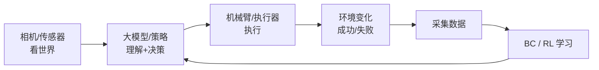

# 端到端部署复盘与综合小项目设计

> **阶段**：扩展章节（自学延伸）｜ **承接**：Day 1–60 全链路
> **日期**：2026-10-14（周三）｜ **Day 62 / 63**
> 本篇为 223 节课程的延伸自学章节。把前 60 天学的“相机看到 → 大模型理解 → 机械臂执行 → 数据采集 → BC/RL 学习优化”全链路做一遍复盘，并设计一个可落地的综合小项目。零基础可读；含流程图。

## 一、今日内容（为什么复盘 + 做项目）

Day 60 结营时说过：“60 天走完≠真会——关键看你能不能独立把那条链路讲清楚、跑通一遍。”今天就是干这件事：① 把全链路画成一张图；② 设计一个**综合小项目**把各环节串起来；③ 用我自己的软体手做例子。

## 二、核心知识点（零基础讲透）

### 2.1 全链路长什么样
感知 → 决策 → 控制 → 执行 的闭环，落到具身智能就是：
- **相机/传感器**看到世界（Day 21–28 视觉）；
- **大模型/算法**理解意图、给指令（Day 42–50 大模型/MCP；或 RL 策略 Day 57–60）；
- **机械臂/执行器**执行（Day 12–20 运动学/PID；Day 51–56 BC）；
- **采集数据**回灌，让 BC/RL 越学越好（Day 51–56，Day 57–60）。

### 2.2 综合小项目怎么设计（STAR 思路）
选一个小而完整的任务，比如“软体手抓水杯”：
- **背景**：桌面有一个水杯，要让机械臂用软体手抓起来放到指定位置。
- **感知**：摄像头识别水杯位置（YOLO / 颜色 / 手眼标定，Day 21–28）。
- **决策/执行**：BC 从示教学抓取（Day 51–56），或 RL 自己练（Day 57–60）。
- **控制**：PID 稳轨迹（Day 17–20），IK 把目标点变关节角（Day 12–16）。
- **数据闭环**：每次成功/失败都存下来，扩充 BC 数据集或当 RL 奖励。
- **难点预埋**：光照变化、水杯位置偏移、软体手形变不确定 → 正好用 Day 61 的域随机化。

### 2.3 为什么“小项目”比“再看一遍视频”有用
看视频是被动输入；做项目是主动把知识**连成网**。遇到卡点再去翻对应 Day，记忆才扎实。这也是面试里讲项目最有力的素材。

### 2.4 DEA 软体手版（轻量交叉）
把“刚性夹爪”换成我的 DEA 软体手：动作空间从“关节角”变成“驱动电压”，目标是“温柔包住水杯不捏碎”。感知仍用相机，控制仍要 PID/IK，但**柔顺性来自材料本身**——这正是软体执行器相对刚性臂的独特优势。

## 2.5 补充细节：链路里的坑与衔接

- 视觉坐标和机械臂基坐标系不统一 → 抓偏（Day 24 易错点）。
- 示教数据太单一 → BC 泛化差（Day 54/55 易错点）。
- RL 奖励难设计、训练不稳（Day 57/59 易错点）。
- 仿真训好上真机掉性能 → 域随机化（Day 61）。
- 一句话：每个 Day 的“易错点”都是这条链路上的一个真实故障点。

## 3. 一张图（Mermaid）

## 三、动手操作（跑通才算学会）

1. 在纸上画出上面的全链路图，标出每个环节对应哪个 Day。
2. 给自己定一个“综合小项目”（哪怕只是“让臂把方块从 A 移到 B”），写出它的 STAR 拆解。
3. 列出这个项目会踩的 3 个坑，并对应到前面学过的哪个 Day 能解决。

## 四、易错点（前人踩过的坑）

- **复盘只“看”不“画”**：不动笔画出链路，知识是散的；画一遍才连成网。
- **项目贪大**：一上来做“全自主家务机器人”容易烂尾；先做一个能端到端跑通的小任务。
- **忽视数据闭环**：做完一次就结束，没把成败存下来喂给 BC/RL，等于白做。

## 五、DEA / 软体机器人交叉链接（轻量）

DEA 软体手做综合项目时，柔顺抓取天然适配易碎/异形物体；把“电压驱动 + 视觉伺服 + BC 数据闭环”串起来，就是我研究方向的一个最小可行原型。

## 六、今日小结 & 镜子复述 3 分钟

今天把 60 天的知识连成一张网：相机→大模型/策略→机械臂→数据→BC/RL，再回到决策，形成闭环。最好的复习是做一个端到端小项目，并在过程中把每个 Day 的易错点当成真实故障去排。下一章把这条链路接到我自己的软体执行器研究上。

> 说明：本系列为通用具身智能学习笔记（不是军事专题）。DEA（介电弹性体驱动器）仅作与本人研究方向的轻量交叉，不展开、不占主线。