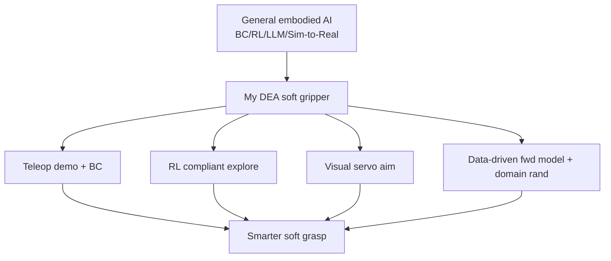

# Soft Actuators × Embodied AI: My Research Direction Link (DEA)

> **Phase**: Extension (self-study) ｜ **Position**: the “capstone” research-direction chapter
> **Date**: 2026-10-15 (Thursday) ｜ **Day 63 / 63**
> This is an extension chapter beyond the 223-lecture course, and the capstone of this three-day extension: connecting the previous 60 days of embodied-AI knowledge to my own research direction — soft robotics / Dielectric Elastomer Actuators (DEA). First-person; zero military; includes a link diagram.

## 1. Today's Content (why write this chapter)

For 60 days I've been learning “general embodied AI”: rigid arms, BC/RL, LLMs, Sim-to-Real. But my real identity is a **soft-robotics / DEA graduate researcher**. This chapter answers one question: **how does this general knowledge become an accelerator for my own research?**

## 2. Core Concepts (Zero-Base Deep Dive)

### 2.1 My research direction in one sentence
Use **Dielectric Elastomer Actuators (DEA)** to build soft actuators / artificial muscles: apply an electric field to a film → the film contracts and deforms → produces force and displacement. They are soft, light, high energy-density — ideal for “gentle yet strong” grippers and joints.

### 2.2 What embodied AI brings to my research
- **Data loop (BC)**: teleoperate-demonstrate a soft gripper → BC learns the grasp policy, turning “how to grasp” from hand-tuned parameters into “data-driven”. Builds on Day 51–56.
- **Exploration (RL)**: soft deformation is hard to model, so RL can “learn to move without modeling”, guided by reward toward compliant motion. Builds on Day 57–60.
- **Perceptual servo**: camera recognition + hand-eye calibration aim the soft gripper at the target. Builds on Day 21–28.
- **Sim-to-Real**: DEA deformation is hard to simulate, so use a data-driven forward model + domain randomization to bridge the gap. Builds on Day 61.

### 2.3 What soft actuators bring back to embodied AI
- **Intrinsic compliance**: won't hard-collide with people / fragile objects — naturally safe, a must-have for service robots and human-robot collaboration.
- **Continuous deformation = continuous action space**: a richer “action language” for imitation/RL, though also harder (see Day 61's difficulty).
- **New task forms**: grasping irregular, fragile, flexible objects that rigid grippers do poorly — soft grippers excel.

### 2.4 My “minimum viable research cut”
Make Day 61–62's integrated project concrete:
- **Task**: DEA soft gripper visually-servo grasps a fragile cup.
- **Method**: teleop demonstration → BC learns policy → a little real data fine-tune (Day 61 domain randomization) → closed-loop optimization.
- **Metrics**: success rate, compliance (does it crush?), generalization (cup position / lighting change).

## 2.5 Extra Detail: terminology & boundaries (avoid overclaiming)

- DEA is at the **actuator material / device** level; embodied AI is at the **system / algorithm** level. What I do is “use embodied-AI methods to make DEA soft grippers smarter”, not “build a new AI model”.
- Zero-military statement: everything in this repo is general academic/engineering study, with no military or weapons-related research.

## 3. One Diagram (Mermaid) — general embodied AI → my DEA research

## 4. Hands-On (Run It to Learn It)

1. Write your own one-sentence “research direction × embodied AI” link (replace my DEA example).
2. From Day 1–62, pick 3 Days most likely usable in your research and say how.
3. Design a “minimum viable cut”: task / method / metric, one sentence each.

## 5. Pitfalls (Lessons from Others)

- **Calling “using AI tools” “doing AI research”**: I use embodied-AI methods to empower soft actuators — keep the boundary clear (see 2.5).
- **Ignoring Sim-to-Real's extra difficulty for soft bodies**: DEA hysteresis is non-linear, the gap is larger than for rigid arms — don't be optimistic.
- **Talking only materials, not systems**: pure-device research easily disconnects from “intelligence”; connect the perceive-decide-act loop and the value becomes complete.

## 6. DEA / Soft-Robot Cross-Link (main line of this chapter)

This chapter is the “capstone” of the DEA cross-link: the earlier Days' “light cross-links” converge here into the main line — using BC/RL/Sim-to-Real to give DEA soft grippers perception-decision-execution intelligence. This is the starting point of my personal research route.

## 7. Daily Summary & 3-Min Mirror Recap

These three extension days (Day 61–63) push the course capstone toward deployment: Sim-to-Real solves “train in sim, use on real”; the integrated project connects the full pipeline into a network; today we connect that network to my own DEA soft-actuator research. One line to close: **embodied AI is not a fresh start, but a “perceive-decide-act-learn” nervous system added onto my original soft-robotics research.**

> Note: This series is general embodied-AI study notes (not a military topic). In this chapter the DEA cross-link becomes the main line, but stays within general academic/engineering study, with no military or weapons content.