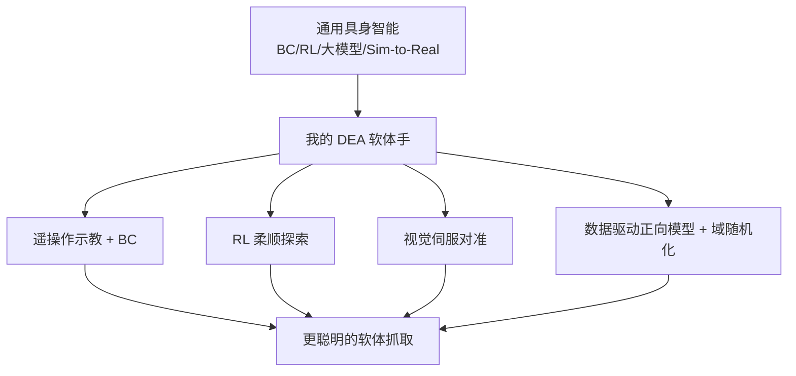

# 软体执行器 × 具身智能：我的研究方向衔接（DEA）

> **阶段**：扩展章节（自学延伸）｜ **定位**：研究方向的“收口”章
> **日期**：2026-10-15（周四）｜ **Day 63 / 63**
> 本篇为 223 节课程的延伸自学章节，也是这三天扩展的收尾：把前面 60 天具身智能的知识，接到我本人的研究方向——软体机器人 / 介电弹性体驱动器（DEA）。第一视角、零军事；含衔接图。

## 一、今日内容（为什么要写这一章）

前 60 天我一直在学“通用具身智能”：刚性机械臂、BC/RL、大模型、Sim-to-Real。但我的真实身份是**软体机器人 / DEA 方向的研究生**。这一章回答一个问题：**这套通用知识，怎么变成我研究的“加速剂”？**

## 二、核心知识点（零基础讲透）

### 2.1 我的研究方向一句话
用**介电弹性体驱动器（DEA）**做软体执行器 / 人工肌肉：给薄膜加电场→薄膜收缩变形→产生力和位移。它柔软、轻、能量密度高，适合做“温柔又有力”的抓手和关节。

### 2.2 具身智能能给我的研究带来什么
- **数据闭环（BC）**：用遥操作给软体手示教→BC 学抓取策略，把“怎么抓”从手工调参变成“数据驱动”。承接 Day 51–56。
- **探索优化（RL）**：软体形变难建模，RL 可以“不建模也学着动”，用奖励引导柔顺动作。承接 Day 57–60。
- **感知伺服**：相机识别 + 手眼标定，让软体手对准目标。承接 Day 21–28。
- **Sim-to-Real**：DEA 形变难仿真，用数据驱动正向模型 + 域随机化 bridging gap。承接 Day 61。

### 2.3 反过来，软体执行器能给具身智能带来什么
- **本征柔顺**：碰到人/易碎物不会硬撞，天然安全——是服务机器人、人机协作的刚需。
- **连续形变 = 连续动作空间**：对模仿/强化学习是更丰富的“动作语言”，但也更难（见 Day 61 的难点）。
- **新任务形态**：抓异形、易碎、柔性物体，刚性夹爪做不好，软体手擅长。

### 2.4 我的“最小可行研究切口”
把 Day 61–62 的综合项目具体化：
- **任务**：DEA 软体手视觉伺服抓取易碎杯。
- **方法**：遥操作示教 → BC 学策略 → 真机少量数据微调（Day 61 域随机化）→ 闭环优化。
- **验证**：成功率、柔顺度（是否捏碎）、泛化（杯位/光照变化）。

## 2.5 补充细节：术语与边界（避免夸大）

- DEA 是**执行器材料/器件**层面；具身智能是**系统/算法**层面。我做的是“用具身智能的方法让 DEA 软体手更聪明”，不是“造一个新 AI 模型”。
- 零军事声明：本仓库所有内容均为通用学术/工程学习，不含任何军事或武器相关研究。

## 3. 一张图（Mermaid）—— 通用具身智能 → 我的 DEA 研究

## 三、动手操作（跑通才算学会）

1. 写下你自己的“研究方向 × 具身智能”一句话衔接（替换我的 DEA 例子）。
2. 从 Day 1–62 里挑 3 个最可能被你研究用到的 Day，说明怎么用。
3. 设计一个“最小可行切口”：任务 / 方法 / 验证指标，各写一句。

## 四、易错点（前人踩过的坑）

- **把“用 AI 工具”说成“做 AI 研究”**：我是用具身智能方法赋能软体执行器，边界要讲清（见 2.5）。
- **忽视 Sim-to-Real 对软体的额外难度**：DEA 形变迟滞非线性，gap 比刚性臂大，别乐观。
- **只谈材料不谈系统**：纯器件研究容易和“智能”脱节；把感知-决策-执行闭环接上，价值才完整。

## 五、DEA / 软体机器人交叉链接（本章主线）

本章即 DEA 交叉的“收口”：前面各 Day 的“轻量交叉”在这里汇成主线——用 BC/RL/Sim-to-Real 让 DEA 软体手具备感知-决策-执行的智能。这是我个人研究路线的起点。

## 六、今日小结 & 镜子复述 3 分钟

这三天扩展（Day 61–63）把课程收尾推向落地：Sim-to-Real 解决“仿真训、真机用”；综合项目把全链路连成网；今天把这张网接到我的 DEA 软体执行器研究。一句话收官：**具身智能不是另起炉灶，而是给我原本的软体机器人研究，装上一套“感知-决策-执行-学习”的神经系统。**

> 说明：本系列为通用具身智能学习笔记（不是军事专题）。本章 DEA 交叉升为主线，但仍限定于通用学术/工程学习，不含任何军事或武器内容。